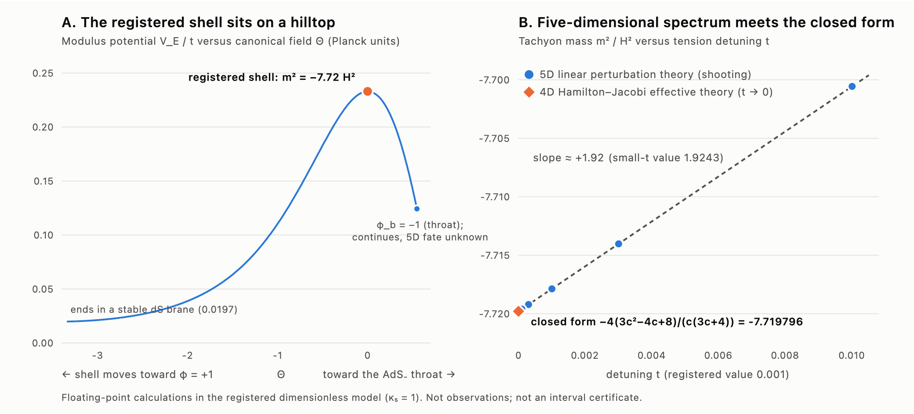
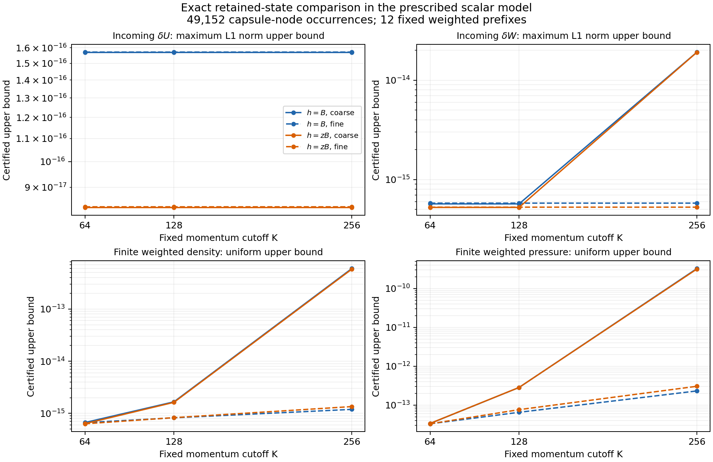
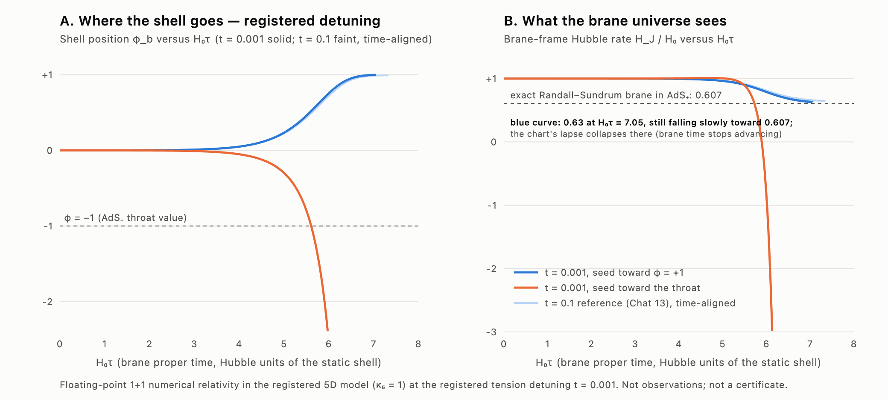

# HDBLAST — Could a higher-dimensional "blast" have sparked our Big Bang?

**Completed research — 8 October 2026 UTC:** normal and optimized runs completed **98,304 retained-endpoint comparisons** at eta = -4 and -3.5, from the exact represented saved incoming state at eta = -4.5. Their nine scientific files are byte-identical, independently checked. Across all endpoints the Cartesian L1 saved-minus-exact-flow discrepancy bounds are **U < 2.520 × 10⁻¹⁶** and **W < 3.158 × 10⁻¹⁵**. This encloses the saved endpoint evolution discrepancy; it does not recover the unsaved dense path. Separate stable flat half-space response/noise and incident-packet results passed conditional analytic review: an exact four-dimensional continuum replica prevents dimensional identification, and the static linear incident model gives transient storage followed by reflection, without permanent capture or thermalization under its stated packet assumptions. Full continuous pressure/contact/time/momentum/UV certification remains **UNRESOLVED**, metric calibration **FAIL**, higher-dimensional Big Bang cause **NOT_ESTABLISHED**, and external novelty **NOT_ASSESSED**. Fresh normal/optimized portable replay and numerical/bulk-model CI passed; final-document-head CI and live site deployment are recorded separately in the final delivery receipt. Latest verified Zenodo publication is **[23244754](https://doi.org/10.5281/zenodo.23244754) / concept 17088132 / 31 files / 453,646,943 bytes**. [Publication proof](https://github.com/maldonado-research/HDblast/blob/main/hdblast/publication/2026.10.08-retained-endpoint-flow/README.md) · [Replay and CI evidence](https://github.com/maldonado-research/HDblast/blob/main/hdblast/continuation/2026.10.08-retained-endpoint-flow/README.md). [Current status](hdblast/CURRENT_STATUS.md).

[Readable project overview](https://maldonado-research.github.io/projects/hdblast/) · [All research projects](https://maldonado-research.github.io/)

**Previous research and publication status (7 October 2026, Pacific):** [Start here](hdblast/CURRENT_STATUS.md). The [retained-state comparison](research/HDBLAST_CHECKPOINT_20261007_STORED_STATE_COMPARISON/RESULTS.md) encloses the original incoming-state error at **all 49,152 capsule-node occurrences** in four authenticated archives. Exact decoding of their saved binary80 values is compared with a certified target at every node. For normalized W = w/epsilon, the largest Cartesian L1 error bound is below **1.914 × 10⁻¹⁴** on the coarse grid and **5.776 × 10⁻¹⁶** on the fine grid. The original incoming-state error is now **ENCLOSED at the saved nodes**; exact continuous-time transport applies to the **twelve fixed finite-weight sums**, conditional on identical subsequent forcing and full contacts. Eight scientific artifacts reproduce byte for byte in normal and optimized Python, and a separate serialized-output audit independently verifies all node summaries. This does not certify the later saved numerical trajectories or continuous momentum integral. The full twelve-case certificate remains **UNRESOLVED**, metric calibration **FAIL**, a higher-dimensional Big Bang origin **NOT_ESTABLISHED**, and external novelty **NOT_ASSESSED**. The verified same-family edition [23228395](https://zenodo.org/records/23228395), DOI **10.5281/zenodo.23228395**, preserves all 27 files from 23225288 and adds a compact scientific supplement and a revised original overview: The scientific supplement contains all registered checkpoint code, exact proofs, compact outputs, independent reviews and original figures. The [complete replay package](https://github.com/maldonado-research/HDblast/tree/13a30ef46f5c90c1b01ae83b609db65fd0f8a709/research/HDBLAST_STORED_STATE_COMPARISON_PACKAGE_20261007) and [full node-level checkpoint evidence](https://github.com/maldonado-research/HDblast/tree/13a30ef46f5c90c1b01ae83b609db65fd0f8a709/research/HDBLAST_CHECKPOINT_20261007_STORED_STATE_COMPARISON) remain pinned to immutable GitHub commit `13a30ef46f5c90c1b01ae83b609db65fd0f8a709`, including the original replay inputs and both large node-level payloads. **29 files / 451,598,148 bytes**. [Publication proof](hdblast/publication/2026.10.07-stored-state-comparison/README.md).

**Ricardo Maldonado · independent researcher · research program 2025–2026**

**Website:** <https://maldonado-research.github.io/HDblast/> ·
**Zenodo (all versions):** [10.5281/zenodo.17088132](https://doi.org/10.5281/zenodo.17088132) ·
**Static-branch companion:** [Zenodo 23111008](https://zenodo.org/records/23111008), preserving the original two-file study from [22922928](https://zenodo.org/records/22922928),
separate concept [10.5281/zenodo.22922927](https://doi.org/10.5281/zenodo.22922927).
[Preserved earlier main edition 23114217](https://zenodo.org/records/23114217), semantic version **2026.10.03-verified-source-operator**, verified on 7 October 2026, Pacific. The complete 23-file inventory and attachment bytes were checked; the [publication proof](hdblast/publication/2026.10.07-verified-publication/README.md) distinguishes reviewed Notes serialization from the preserved original literal failure. This is archival verification, with no physical rerun or external peer review.

> HDBLAST asks whether a violent gravitational event in a fifth dimension, the "blast", could have
> transferred energy into our four-dimensional universe and started the hot Big Bang.

This is a **speculative, testable research hypothesis. It is not a discovery.** It has not
proven that extra dimensions exist or what caused the Big Bang, and no observation supports it
yet. It has not been peer reviewed. What the program does have is a dated public record:
explicit equations, reproducible code, certified and numerical calculations, negative results,
and published corrections. Every result below carries a label saying exactly how well it is
established.

---

## The idea in one picture

Our universe may behave like a thin **shell (a "brane")** inside a larger five-dimensional
space. Gravity and a field called a *scalar* fill that larger space. If the shell sits in an
unstable balance, like a ball on a hilltop, it can roll off, and that motion releases energy.
HDBLAST asks whether such a higher-dimensional event could have produced the hot, dense early
universe that the standard Big Bang model starts from. The hypothesis would **extend** the
standard Big Bang story, not replace it.

*Left: the registered shell sits on top of a potential "hill", so it is unstable. Right: the
instability rate from full five-dimensional theory agrees with a closed-form four-dimensional
formula. Floating-point calculations in the model; not observations.*

**Previous result (7 October 2026, Pacific): every retained incoming-state node compared with a certified target.** The [comparison checkpoint](research/HDBLAST_CHECKPOINT_20261007_STORED_STATE_COMPARISON/RESULTS.md) authenticates all four compact archives and their 76 members before decoding 20 selected arrays. It compares exactly decoded binary80 states with complete target enclosures at all **49,152 capsule-node occurrences**, without projecting or replacing the stored states. The normalized responses are U = u/epsilon and W = w/epsilon. Their Cartesian L1 discrepancy uses |Re error| + |Im error|. The maximum U upper bound is below **1.571 × 10⁻¹⁶**; the W upper bound is below **1.914 × 10⁻¹⁴** on the coarse grid and **5.776 × 10⁻¹⁶** on the fine grid. The coarse W peaks occur near k = 256; this observed grid difference does not by itself prove continuum convergence or explain its cause.

Exact error transport gives density, pressure, work and pressure-time-integral bounds throughout the declared later time interval for **twelve fixed finite-weight prefixes**, provided later forcing and full contacts are identical. Physical forcing remains active. These are scaled first-order model responses, with density and pressure in a0⁴/epsilon units. No later retained numerical trajectory, full momentum integral, contact defect or ultraviolet tail is certified. The full twelve-case certificate remains **UNRESOLVED** and the inherited **2 × 10⁻⁸** gate is unchanged. [Independent readback](research/HDBLAST_CHECKPOINT_20261007_STORED_STATE_COMPARISON/evidence/independent-actual/ACTUAL_OUTPUT_INDEPENDENT_REVIEW.md) verifies all 49,152 serialized nodes and the twelve summaries without importing the numerical producer or evaluating a new physical source.

*Upper bounds under the prescribed scalar-response model, not observations. U and W are normalized by the represented epsilon; density and pressure are a0⁴/epsilon scaled first-order finite sums. The figure uses binary64 display coordinates; exact rational values are in the checkpoint table.*

A [bounded literature refresh](research/HDBLAST_CHECKPOINT_20261007_STORED_STATE_COMPARISON/literature/LITERATURE_REFRESH_AND_MODEL_TEST.md) records 22 searches and selected primary passages from eight papers. It motivates action-derived correlated predictions and an explicit rival-model comparison; it supplies no new observational confirmation. The [conditional identifiability argument](research/HDBLAST_CHECKPOINT_20261007_STORED_STATE_COMPARISON/physical-identifiability/STRUCTURAL_IDENTIFIABILITY.md) shows that common effective inputs can give identical observable laws under dimensional and four-dimensional descriptions. It is not a universal exclusion of extra dimensions. The physical origin remains **NOT_ESTABLISHED** and external novelty **NOT_ASSESSED**.

**Previous checkpoint (7 October 2026, Pacific): prescribed BD prehistory target enclosures.** The [BD prehistory checkpoint](research/HDBLAST_CHECKPOINT_20261007_BD_PREHISTORY/RESULTS.md) encloses the prescribed exact continuum Bunch–Davies target at eta = −4.5 for two smooth sources and nine fixed rational momenta. Both independent routes pass the **10⁻²⁰** exported L1 radius gate for all **36 complex rectangles**, and all **36 pairs / 72 real and imaginary components** intersect. The largest radii are below **1.555 × 10⁻²¹** and **3.138 × 10⁻²³**, respectively. At that checkpoint the stored binary80 state error was **NOT_ENCLOSED**; the new saved-node comparison above encloses that component. The full twelve-case certificate remains **UNRESOLVED**, metric calibration **FAIL**, and a higher-dimensional Big Bang origin **NOT_ESTABLISHED**. A separate exact postprocessor bounds the source representation and choice of real polynomial coefficients continuously over **0 < k ≤ 256** and **eta ∈ [−4.5,−3.5]**. Across both sources, the scaled density contribution is below **4.094 × 10⁻²¹** and the scaled pressure contribution below **1.625 × 10⁻¹⁸**. These bounds cover the source/cap and coefficient-choice component. They exclude continuous numerical phase and ODE arithmetic, original stored-state error, full contacts, quadrature and the ultraviolet tail; they do not establish a continuous full-arithmetic mode or momentum-integral certificate.

**Previous result (7 October 2026, Pacific): conditional incoming-state transfer and stress bounds.** The direct density and pressure operators give exact homogeneous-state transfer for identical forcing and unchanged full contacts, with phase retained. First-order normalization leaves the state amplitude unbounded. With normalization drift independently controlled, a proved amplitude bound gives conditional finite-band density/pressure error bounds. The direct operators also give an exact signed pressure time primitive; this work supplies no actual incoming-state enclosure or full numerical certificate. The ultraviolet tail, full twelve-case certificate and physical cosmological mechanism remain unresolved; metric calibration remains **FAIL**. [Result, proof and limits](research/HDBLAST_CHECKPOINT_20261007_INCOMING_STATE/RESULTS.md).

**Previous result (5 October 2026 UTC): exact finite-band stress kernels and error bounds.** The source Taylor-truncation contribution throughout the declared time interval and continuous momentum band k ∈ [0,256] is below **5.5 × 10⁻²⁸** in scaled density and **2.2 × 10⁻²⁵** in scaled pressure, conditional on the inherited analytic premises. These are bounds for one error component. Exact state/residual/contact identities retain the other terms, and a smooth normalized state change can evade all nine probes while changing integrated stress. Three exact implementations pass 41, 55 and 42 checks with mutation controls and a clean six-run archive replay. The full numerical certificate remains **UNRESOLVED**; no physical breakthrough or external novelty is established. [Result, proof and limits](research/HDBLAST_CHECKPOINT_20261005_FINITE_BAND_WARD/RESULTS.md) · [Standalone reproduction](research/HDBLAST_FINITE_BAND_WARD_PACKAGE_20261005/RESULTS_READ_FIRST.md).

**Previous result (3 October 2026, Pacific): conditional source-operator certificate.** Two independently implemented enclosure methods pass all 1,170 moment rows and 130 source-primitive rows per route for two declared smooth sources, 64 panels and nine exact rational momenta. The largest conservative whole-interval enclosure radius across both implementations is below **1.373 × 10⁻²⁸**, within the fixed **10⁻²⁶** limit. The analytic model bounds cover real momentum k ∈ [0,256]; computed complete enclosure widths are certified at the nine probes. The full twelve-case action-derived pressure/contact conservation certificate remains **unresolved**, and earlier metric calibration stays **FAIL**. A higher-dimensional cause of the Big Bang is **NOT_ESTABLISHED**; external mathematical novelty is **NOT_ASSESSED**. [Research manuscript, result and limits](research/HDBLAST_CHECKPOINT_20261003_VERIFIED_SOURCE_OPERATOR/RESULTS.md) · [Standalone archive replay](research/HDBLAST_VERIFIED_SOURCE_OPERATOR_PACKAGE_20261003/RESULTS_READ_FIRST.md). A fresh standalone archive replay reproduces both numerical payloads and scientific frames exactly.

[Fresh archive reproduction evidence](research/HDBLAST_VERIFIED_SOURCE_OPERATOR_PACKAGE_20261003/FRESH_REPRODUCTION.json).

**Previous active-source diagnostic (2 October Pacific; checkpoint dated 3 October UTC):** Two independent implementations diagnose ledger-sampling error during the active-source interval. All twelve consistency cases pass; eight meet the fixed attribution threshold. A full standalone archive replay reproduces every registered scientific value exactly. Earlier metric calibration remains **FAIL**; continuum accuracy, the inherited quantum state, coupled evolution and the higher-dimensional hypothesis remain unresolved. [Measured result and limits](research/HDBLAST_ACTIVE_SOURCE_LEDGER_PACKAGE_20261002/FINAL_RESULT.md), [independent review](research/HDBLAST_ACTIVE_SOURCE_LEDGER_PACKAGE_20261002/advisory_review/completed_original_001/INTERPRETATION.md), and [fresh reproduction evidence](research/HDBLAST_ACTIVE_SOURCE_LEDGER_PACKAGE_20261002/FRESH_REPRODUCTION.json).

**Previous source-free diagnostic (2 October):** Two independent implementations identify a time-integration error after source support. All twelve consistency cases pass, and eight cross the fixed error-attribution threshold. [Preserved result and evidence](research/HDBLAST_CHECKPOINT_20261002_SOURCE_FREE_LEDGER/reports/RESULTS.md).

## Where the research stands (7 October 2026, Pacific)

| Result | Status |
|---|---|
| Original saved-node incoming-state error: 49,152 capsule-node occurrences, two sources and coarse/fine grids | **ENCLOSED at saved nodes**, with exact continuous-time transport for twelve fixed finite-weight sums under identical later forcing/contacts; full continuous momentum certificate unresolved |
| Prescribed analytic BD prehistory target: two sources × nine fixed momenta, 36 complex rectangles per route; both independent exported-radius gates pass and all pairs intersect | **Certified target enclosures**, conditional on the frozen analytic and arithmetic premises; the later all-node comparison encloses the saved incoming-state component |
| Continuous source/cap and real coefficient-choice representation contribution on 0 < k ≤ 256 and eta ∈ [−4.5,−3.5] | **Certified component bounds**; continuous phase/ODE arithmetic and full momentum integrals remain outside this certificate |
| A specific five-dimensional model is fixed in advance ("registered"): Einstein gravity plus a scalar field, with W(φ)=1−φ+φ³/3 and shell tension σ=2W+δ(1+cφ), δ=0.001 | Definition |
| Within the model, the registered shell solution exists (computer-assisted proof with local uniqueness; a statement about the equations, not about nature) | **Certified**, conditional on its listed premises |
| The shell has an unstable (tachyonic) scalar mode, m² ≈ −7.7179 H², growth e^{1.657 Hτ}; numerically it is the only one. No unstable mode exists in the tensor, vector or special-harmonic sectors (mode stability, not full linear stability). | **Certified**, conditional (the scalar mode exists) / **Numerical** (uniqueness) / **Exact** (other sectors) |
| A closed-form 4D effective theory reproduces the 5D instability to about 10⁻⁶ | **Exact + numerical** |
| Full nonlinear 5D evolution: the shell rolls off toward one of **two fates**, relaxation toward an empty de Sitter brane (endpoint not yet reached in the simulations) or reversal and collapse | **Numerical** |
| Neither fate produces a radiation-filled (hot Big Bang) universe **in the homogeneous, classical roll-off of this model with no added matter** | **Negative result** |
| The earlier late-time endpoint (constant φ=1) fails a boundary condition; a corrected static solution was found | **Exact** (the failure) / **Numerical** (the new solution) |
| A proposed extension adds a new matter field to the shell, with an exact energy-exchange law; later checkpoints test particle production under stated approximations | **Exact**, as a proposal |
| An earlier (July 2026) gravitational-radiation claim was **withdrawn** after an audit | **Published correction** |
| A pulsar-timing "knee" signature was proposed and screened against public data | **Screening only**; not derived from the 5D model; the strict registered test failed on pilot data |
| **New (27 Sept):** the corrected end state (the "+1 branch") is linearly stable in the sectors tested; two independent methods agree, each first calibrated on the known instability | **Numerical**, independently audited (not a proof) |
| **New (27 Sept):** exact small-parameter series for the end state through eighth order, confirmed to 30–40 digits | **Exact**, independently re-derived |
| **New (27 Sept):** particle production and six other heating routes screened; none gives a radiation era in the registered model. The obstacle is leftover vacuum energy (about 0.6 of the ~22 e-folds needed) | **Negative**, under stated assumptions |
| **New (27 Sept):** an added tension term cancels the leftover vacuum, but "dark radiation" from the fifth dimension stays above observational limits so far | **Inconclusive** (requires a model change) |
| **New (28 Sept):** with the tension tuned to cancel the leftover vacuum (model change) and a stand-in (friction) energy-transfer formula, a radiation-dominated phase appears; "dark radiation" is 7.3% of the radiation at transfer rate Y = 1, within the conservative limit. A 1% change in the tuning removes it | **Numerical**, conditional, fine-tuned ([verdict](research/HDBLAST_CHECKPOINT_20260928/A1_tuned_vacuum/A1_VERDICT.md)) |
| **New (30 Sept):** at Y = 2 the dark radiation falls to 2.1%, within the strict current limit (3%). The phase lasts under half an expansion e-fold before leftover negative vacuum energy recollapses the shell, needs the tuning to about 1 part in 10⁴, and still uses the stand-in formula | **Numerical**, model-internal, conditional |
| **New (30 Sept):** replacing the stand-in with particle production derived from the matter extension: with particle masses below the 5D gravity scale, dark radiation stays far larger than the radiation; no steady state in 32 runs | **Inconclusive**, leaning negative |
| **New (30 Sept):** the same test at the registered δ = 0.001 is not completed; the numerical breakdown is diagnosed but not fixed. A simple 4D model does not reproduce the 5D dark-radiation numbers | **Inconclusive** / **Negative** (4D shortcut) |
| **New (1 Oct):** a single-cohort energy envelope includes radiation and undecayed particles. The two locally screened archived crossing cases remain far below the radiation target at the tested endpoint, even with optimistically timed decay. This uses a fixed history and a cutoff screen, not a complete quantum calculation | **Analytical bound + exploratory numerical application**, conditional |
| **New (1 Oct):** an executed audit of saved trajectories finds an earlier radiation-dominated sampled interval of about **0.314 e-fold** in the finer Y=2 run under a new cancellation-resistant diagnostic. Its later plateau fails this diagnostic. The original registered verdict is unchanged | **Post hoc saved-data diagnostic**; stand-in source, sampled duration |
| **New (1 Oct):** the particle-mode solver passes 90 exact pulse occupation checks, including reflectionless cases, and 30 fine-resolution Wronskian checks | **Registered numerical control**; not a coupled 5D matter result |
| **New (1 Oct, quantum modes):** actual scalar modes on the archived source-free tuned shell give a particle count 0.0503% below the earlier corrected estimate for the declared finite-band state. Coherence adds 10.96% to the particle-only scalar current and reverses the relative pressure's sign. Ten registered variants and independent RK4 checks pass | **Numerical**, prescribed background and relative stress; not a radiation era |
| **New (1 Oct, quantum matching):** the proposed scalar loop requires additional quartic-potential and intrinsic-curvature terms in the shell action | **Analytical EFT requirement**; curved-shell matching coefficients and absolute source unresolved |
| **New (1 Oct Pacific / 2 Oct UTC, curved-source readiness):** all eight reconstruction controls pass after a preserved numerical repair; the archived interpolation and initial state have distinct ultraviolet obstructions. Smooth fits show initial-boundary derivative sensitivity. Exact-rational subtraction checks and 18 independent toy evolutions pass | **Readiness audit**; absolute curved source remains unestablished |
| **New (2 Oct):** a flat-background quantum source through a smooth mass-zero crossing passes eight registered variants, exact scattering, energy/work and independent pressure-trace checks. Potential and curvature matching are fixed at a stated reference | **Numerical benchmark**, prescribed Minkowski background; not coupled shell evolution |
| **New (2 Oct):** omitting curvature matching makes pressure drift with the regulator even though energy conservation passes. A direct physical-mode representation has the expected cutoff convergence and an exact finite-cutoff trace identity | **Analytical and numerical checks**; finite-PV sources retain several-percent regulator effects |
| **New (1 Oct Pacific / 2 Oct UTC, smooth curved source):** the original flat control passes and original curved pressure cutoff fails; a separately registered K384 follow-up passes all 13 groups, with a 0.2291% pressure cutoff change. Stress and paired source use one finite action | **Finite-cutoff numerical benchmark**, prescribed smooth FRW geometry; not coupled shell evolution |
| **New (2 Oct, coupled-source prerequisites):** action-derived energy, pressure and scalar-current junctions pass separate exact checks. A stationary de Sitter bridge gives a conditional small-source expansion and identifies an unresolved tiny archived response | **Algebra and archived-data reanalysis**; at that checkpoint, de Sitter quantum expectations and coupled evolution were uncomputed |
| **New (2 Oct, massive de Sitter sources):** four registered common-reference quantum-vacuum cases pass 57 checks and a separate proper-time calculation; direct mode subtraction independently checks pressure at one curved point. Nineteen classical integrations resolve the previously roundoff-limited stationary response, including its positive sign | **Exact algebra + numerical**, internal independent implementations; no coupled evolution or heating |
| **New (2 Oct, stationary quantum closure):** both quantum sources now enter a regular stationary bulk-and-shell solve. Forty-eight registered roots pass 1,584 corrected checks and independent endpoint/source comparisons. Resolved nonlinear feedback occurs only at a coupling that fails the declared gravity hierarchy screen | **Numerical stationary closure**, declared model; no established physical EFT, stability or heating |
| **New (2 Oct, causal response):** independent forced modes agree with the matched memory formula at 36 finite-cutoff comparisons. Both registered pulses retain negative variance response after the source vanishes; 17 wrong-formula controls are detected | **Numerical fixed-geometry calibration**; stress response, coupled evolution, stability and heating remain untested |
| **New (2 Oct, matched stress):** independently calculated density and pressure pass all 180 registered core comparisons, trace/contact/current checks, raw-mode reconstruction and a separate energy ledger. Higher-derivative stress tail bounds are included | **Numerical linear response**, fixed geometry; no coupled evolution, stability or heating |
| **New (2 Oct, metric response):** three separate registrations preserve continuum roundoff, memory-budget and conservation failures. The memory-only repair completes all four mode evolutions within 256 MiB; 59 Ward checks fail under unchanged thresholds | **Scientific FAIL**, complete saved data; full metric prerequisite remains blocked |
| **New (3 Oct, source-operator prerequisite):** uniform analytic source and phase bounds, independently computed moment/source-primitive enclosures at nine registered momenta; whole-interval hull radius below 1.373 × 10⁻²⁸ | **Conditional certificate**, narrower than full stress/conservation certification; no physical heating result |
| **New (5 Oct, finite-band error theorem):** exact retarded density/pressure kernels, conditional continuous-band source-truncation bounds, complete residual/contact budget and a normalized hidden-state counterexample | **Exact conditional mathematics**, one error component; full numerical certificate unresolved |

*Full five-dimensional numerical relativity at the registered parameters. The shell heads
toward an empty de Sitter brane (blue) or reverses and collapses (orange). Neither branch
contains a hot radiation era.*

The registered homogeneous model has not produced a hot Big Bang. Tuned variants with a stand-in transfer formula meet the earlier radiation-fraction criterion briefly and then recollapse. The first 1 October checkpoint bounds the energy budget and diagnoses a sampled 0.314-e-fold interval. The new quantum-mode calculation tests the proposed matter field on the source-free tuned geometry: its integrated count agrees closely with the corrected crossing estimate, but coherent stress/current matter and the endpoint excitations are not radiation. The 2 October checkpoint now provides an absolute source in a fixed matching convention for a flat-space pulse, including the curvature contribution to pressure. The curved-source readiness audit now quantifies interpolation and initial-state obstructions and finds high-derivative sensitivity at the initial boundary. Its numerical controls pass, but an unchanged extension of the archived finite-band surrogate is not justified. A separately registered smooth FRW follow-up now passes its cutoff, pressure, trace and paired-source controls in a declared finite-action convention; the original curved cutoff failure remains preserved. Smooth initial data for the actual shell, physical matching data, coupled evolution, decay and thermalization remain unresolved.

Earlier metric calibration: [registered memory-only metric followup](research/HDBLAST_CHECKPOINT_20261002_METRIC_RESPONSE_MEMORY_FOLLOWUP/00_READ_FIRST.md), [complete failure evidence](research/HDBLAST_CHECKPOINT_20261002_METRIC_RESPONSE_MEMORY_FOLLOWUP/outputs/NUMERICAL_RESULTS.md), and [standalone expected-failure reproduction](research/HDBLAST_CHECKPOINT_20261002_METRIC_RESPONSE_MEMORY_FOLLOWUP/REPRODUCE.md). All 12 primary observations and four independent evolutions completed. Peak memory is 103,400 KiB; conservation endpoints/refinement fail 59 unchanged checks. Passing the reproduction control preserves scientific FAIL. The completed source-free and active-source diagnostics attribute a sampled-ledger discrepancy; the new source-operator prerequisite supplies conditional enclosures, while the full twelve-case pressure/contact conservation certificate and its inherited 2 × 10⁻⁸ gate remain unresolved before another unchanged metric calibration. Actual-root, lapse, bulk/state response, stability and heating remain unresolved.

Previous: [registered matched minimal stress response](research/HDBLAST_CHECKPOINT_20261002_MATCHED_STRESS/00_READ_FIRST.md), [actual numerical evidence](research/HDBLAST_CHECKPOINT_20261002_MATCHED_STRESS/outputs/NUMERICAL_RESULTS.md), and [self-contained reproduction](research/HDBLAST_CHECKPOINT_20261002_MATCHED_STRESS/REPRODUCE.md). Independent direct density and pressure pass 180 core comparisons, finite-cutoff trace and separate energy-ledger checks with explicit stress tail bounds. After-pulse relative density is negative; pressure need not keep one sign. This is coherent first-order polarization on fixed geometry. Positive canonical excitation energy, metric response, coupled evolution, stability and heating remain open.

Previous: [registered fixed-geometry causal response](research/HDBLAST_CHECKPOINT_20261002_CAUSAL_RESPONSE/00_READ_FIRST.md), [independent scientific review](research/HDBLAST_CHECKPOINT_20261002_CAUSAL_RESPONSE/review/INDEPENDENT_SCIENTIFIC_REVIEW.md), and [self-contained fresh reproduction](research/HDBLAST_CHECKPOINT_20261002_CAUSAL_RESPONSE/REPRODUCE.md). Independent forced modes pass 36 finite-cutoff comparisons and 17 controls; both tested pulses retain negative scalar-variance memory after the source vanishes. The [matched stress proposal](research/HDBLAST_CHECKPOINT_20261002_CAUSAL_RESPONSE/theory/PROSPECTIVE_MATCHED_STRESS_RESPONSE.md) is analytic follow-up, with no new stress experiment. That variance-only checkpoint preceded the separately registered stress test below.

Previous: [stationary quantum shell closure and its limits](research/HDBLAST_CHECKPOINT_20261002_STATIONARY_QUANTUM/00_READ_FIRST.md), [independent internal review](research/HDBLAST_CHECKPOINT_20261002_STATIONARY_QUANTUM/independent/INDEPENDENT_STATIONARY_REVIEW.md), and [fresh reproduction](research/HDBLAST_CHECKPOINT_20261002_STATIONARY_QUANTUM/REPRODUCE.md). The only tested positive coupling that passes the sampled gravity hierarchy screen gives a tiny curvature correction. A [derived causal-response protocol](research/HDBLAST_CHECKPOINT_20261002_STATIONARY_QUANTUM/theory/PROSPECTIVE_CAUSAL_RESPONSE_PROTOCOL.md) specified the subsequent causal experiment, now completed in the separate checkpoint below.

Previous: [massive de Sitter sources and resolved stationary sensitivities](research/HDBLAST_CHECKPOINT_20261002_DESITTER/00_READ_FIRST.md), [independent scientific review](research/HDBLAST_CHECKPOINT_20261002_DESITTER/independent/INDEPENDENT_SCIENTIFIC_REVIEW.md), and [fresh reproduction](research/HDBLAST_CHECKPOINT_20261002_DESITTER/REPRODUCE.md). The sources use a declared finite-action convention; physical mass/coupling choices and causal time-dependent backreaction remain open.

Previous: [coupled-source junctions and stationary initialization bridge](research/HDBLAST_CHECKPOINT_20261002_JUNCTIONS/00_READ_FIRST.md), [independent review](research/HDBLAST_CHECKPOINT_20261002_JUNCTIONS/review/INDEPENDENT_ACTION_AND_JUNCTION_REVIEW.md), and [reproduction](research/HDBLAST_CHECKPOINT_20261002_JUNCTIONS/REPRODUCE.md).

Previous: [smooth curved-background source control](research/HDBLAST_CHECKPOINT_20261002_SMOOTH_FRW/00_READ_FIRST.md), [original results](research/HDBLAST_CHECKPOINT_20261002_SMOOTH_FRW/outputs/original_matrix/NUMERICAL_RESULTS.md), [separate passing follow-up](research/HDBLAST_CHECKPOINT_20261002_SMOOTH_FRW/outputs/followup/FOLLOWUP_RESULTS.md), [reproduction](research/HDBLAST_CHECKPOINT_20261002_SMOOTH_FRW/REPRODUCE.md), [eight checked primary papers](research/HDBLAST_CHECKPOINT_20261002_SMOOTH_FRW/LITERATURE_REVIEW.md), and [self-contained scientific ZIP](research/HDBLAST_CHECKPOINT_20261002_SMOOTH_FRW/HDBLAST_CHECKPOINT_20261002_SMOOTH_FRW.zip).

Previous: [curved-source readiness and ultraviolet audit](research/HDBLAST_CHECKPOINT_20261002_FRW/00_READ_FIRST.md), [measured results](research/HDBLAST_CHECKPOINT_20261002_FRW/NUMERICAL_RESULTS.md), [reproduction](research/HDBLAST_CHECKPOINT_20261002_FRW/REPRODUCE.md), and [self-contained scientific ZIP](research/HDBLAST_CHECKPOINT_20261002_FRW/HDBLAST_CHECKPOINT_20261002_FRW.zip).

Previous: [matched quantum source and pressure checks](research/HDBLAST_CHECKPOINT_20261002_PV/00_READ_FIRST.md), [reproduction](research/HDBLAST_CHECKPOINT_20261002_PV/REPRODUCE.md), [scientific ZIP](research/HDBLAST_CHECKPOINT_20261002_PV/HDBLAST_CHECKPOINT_20261002_PV.zip), and [targeted literature review, including 2026 papers](research/HDBLAST_CHECKPOINT_20261002_PV/LITERATURE_20261002.md).

Previous: [quantum modes, results and limitations](research/HDBLAST_CHECKPOINT_20261001_QFT/00_READ_FIRST.md), [reproduction](research/HDBLAST_CHECKPOINT_20261001_QFT/REPRODUCE.md), and [downloadable scientific package](research/HDBLAST_CHECKPOINT_20261001_QFT/HDBLAST_CHECKPOINT_20261001_QFT.zip).

Earlier: [energy bounds and exact pulse controls](research/HDBLAST_CHECKPOINT_20261001/00_READ_FIRST.md), including a [targeted review of five recent primary papers](research/HDBLAST_CHECKPOINT_20261001/LITERATURE_REVIEW_20261001.md). The new checkpoint adds [five foundational sources on stress/current renormalization and states](research/HDBLAST_CHECKPOINT_20261001_QFT/LITERATURE_AND_RENORMALIZATION.md).

## What would count for or against the hypothesis

For the hypothesis to become credible, all of the following must happen, and it may fail at any step:

1. a consistent matter sector in which the blast produces particles, with their gravity fed back into all equations;
2. a sustained radiation-dominated era with realistic temperature and duration;
3. stable, convergent five-dimensional simulations, with energy fully accounted for;
4. a quantitative prediction that competing explanations do not make;
5. independent reproduction, peer review and observational tests.

## Explore the work

| Where | What |
|---|---|
| [`research/HDBLAST_CHECKPOINT_20261007_STORED_STATE_COMPARISON/`](research/HDBLAST_CHECKPOINT_20261007_STORED_STATE_COMPARISON/RESULTS.md) | All-node retained-state comparison, exact finite-sum transport, original literature review and conditional model-test contract |
| [`research/HDBLAST_CHECKPOINT_20261007_BD_PREHISTORY/`](research/HDBLAST_CHECKPOINT_20261007_BD_PREHISTORY/RESULTS.md) | Prescribed BD prehistory target enclosures, two independent budgets, public-freeze chronology and separate continuous source/real-coefficient bounds. |
| [`hdblast/`](hdblast/) | Start here: the plain-language guide, program map, claims ledger and Zenodo records |
| [`hdblast/checkpoints/`](hdblast/checkpoints/) | Dated research checkpoints (Sept 2026) with reports, code, data and internal AI referee reviews (not external peer review) |
| [`research/HDBLAST_CHECKPOINT_20260927/`](research/HDBLAST_CHECKPOINT_20260927/) | The 27 Sept 2026 checkpoint: stability, exact series, particle production, simulation-error control, new mechanisms and a 2022–2026 literature review, each with an internal audit report. Start with `00_READ_FIRST.md` or `PUBLIC_SUMMARY.md`. Raw simulation arrays (`.npz`) are not included. |
| [`research/HDBLAST_CHECKPOINT_20260928/`](research/HDBLAST_CHECKPOINT_20260928/) | The 28 Sept 2026 tuned-vacuum test (A1): pre-registration, solver, analysis and verdict. |
| [`research/HDBLAST_CHECKPOINT_20260930/`](research/HDBLAST_CHECKPOINT_20260930/) | The 30 Sept 2026 checkpoint: derived particle production, the δ = 0.001 diagnosis, the transfer-rate scan, a 4D cross-check and a fine-tuning measure, each with an independent audit and a final critic pass. Start with `00_READ_FIRST.md`. Raw arrays (`.npz`, `.pkl`) are not included. |
| [`research/HDBLAST_CHECKPOINT_20261001/`](research/HDBLAST_CHECKPOINT_20261001/) | The 1 October checkpoint: cohort bounds, radiation diagnostics, exact mode controls, executable code and internal audits. |
| [`research/HDBLAST_CHECKPOINT_20261001_QFT/`](research/HDBLAST_CHECKPOINT_20261001_QFT/) | Quantum modes on the archived source-free shell, coherent stress/current, EFT matching, raw inputs, figures and independent replay. |
| [`research/HDBLAST_CHECKPOINT_20261002_PV/`](research/HDBLAST_CHECKPOINT_20261002_PV/) | Matched flat-background quantum stress/current, regulator and cutoff tests, exact finite-cutoff trace, figures and reproducible package. |
| [`research/HDBLAST_CHECKPOINT_20261002_FRW/`](research/HDBLAST_CHECKPOINT_20261002_FRW/) | Curved-source readiness, knot/state UV diagnostics, native-spline repair, exact-rational subtraction checks, independent oscillator controls and reproducible package. |
| [`research/HDBLAST_CHECKPOINT_20261002_SMOOTH_FRW/`](research/HDBLAST_CHECKPOINT_20261002_SMOOTH_FRW/) | Common-action smooth FRW stress/source, preserved original failure, separately registered passing K384 follow-up, compact arrays, figures, primary literature and complete replay. |
| [`research/HDBLAST_CHECKPOINT_20261002_STATIONARY_QUANTUM/`](research/HDBLAST_CHECKPOINT_20261002_STATIONARY_QUANTUM/) | Registered paired-source stationary roots, preserved validator failure and repair, independent checks, sampled gravity hierarchy, causal-response proposal and full replay. |
| [`research/HDBLAST_CHECKPOINT_20261002_CAUSAL_RESPONSE/`](research/HDBLAST_CHECKPOINT_20261002_CAUSAL_RESPONSE/) | Registered retarded scalar response, independent forced modes and raw arrays, tail bounds, targeted literature, matched stress proposal and self-contained replay. |
| [`research/HDBLAST_CHECKPOINT_20261002_MATCHED_STRESS/`](research/HDBLAST_CHECKPOINT_20261002_MATCHED_STRESS/) | Registered direct minimal stress/current, independent extended-precision modes, stress tails, separate Ward ledger, raw evidence and self-contained replay. |
| [`research/HDBLAST_CHECKPOINT_20261002_METRIC_RESPONSE_MEMORY_FOLLOWUP/`](research/HDBLAST_CHECKPOINT_20261002_METRIC_RESPONSE_MEMORY_FOLLOWUP/) | Registered memory-only metric followup, complete four-run archives, preserved prior failures and explicit expected-scientific-failure replay. |
| [`research/HDBLAST_CHECKPOINT_20261002_ACTIVE_SOURCE_LEDGER/`](research/HDBLAST_CHECKPOINT_20261002_ACTIVE_SOURCE_LEDGER/) | Original prospective active-source registration and preserved initial execution failure. |
| [`research/HDBLAST_ACTIVE_SOURCE_LEDGER_EXECUTION_REPAIR_20261003/`](research/HDBLAST_ACTIVE_SOURCE_LEDGER_EXECUTION_REPAIR_20261003/) | Disclosed guard-only repair, unchanged scientific methods and complete registered original results. |
| [`research/HDBLAST_ACTIVE_SOURCE_LEDGER_PACKAGE_20261002/`](research/HDBLAST_ACTIVE_SOURCE_LEDGER_PACKAGE_20261002/) | Complete standalone archive, exact fresh physical reproduction, independent attribution/cancellation review and next-study proposal. |
| [`research/HDBLAST_CHECKPOINT_20261003_VERIFIED_SOURCE_OPERATOR/`](research/HDBLAST_CHECKPOINT_20261003_VERIFIED_SOURCE_OPERATOR/) | Frozen source/operator registration, conditional analytic proofs, two independent complete enclosure routes, measured results and standalone replay. |
| [`research/HDBLAST_CHECKPOINT_20261005_FINITE_BAND_WARD/`](research/HDBLAST_CHECKPOINT_20261005_FINITE_BAND_WARD/) | Exact finite-band stress/error kernels, analytic truncation bounds, state counterexample, three proof routes and pinned premises. |
| [`research/HDBLAST_FINITE_BAND_WARD_PACKAGE_20261005/`](research/HDBLAST_FINITE_BAND_WARD_PACKAGE_20261005/) | Sealed standalone mathematical archive and fresh exact replay. |
| [`site/`](site/) | Source of the website |

Most checkpoints can be re-run with Python 3 (`numpy`, `scipy`, `sympy`, `mpmath`). Each
checkpoint has its own `REPRODUCE`/`REPLAY` instructions. The author's raw working archive
(drafts, chats and earlier packages) is kept private; the curated, citable material is here.

## How to cite

Maldonado, R. *HDBLAST: higher-dimensional blast research program.* Zenodo,
[doi:10.5281/zenodo.17088132](https://doi.org/10.5281/zenodo.17088132) (all versions). See
[`CITATION.cff`](CITATION.cff). Each Zenodo record states its own licence.

**License for this repository:** text, figures and data are licensed under
[CC BY 4.0](https://creativecommons.org/licenses/by/4.0/); code is licensed under the MIT License.
Reuse is welcome with credit to Ricardo Maldonado. See [`LICENSE`](LICENSE).

## A note on honesty

This project publishes its failures and corrections alongside its successes. A result is
called established only when a saved script or proof supports it. The reviews inside the
checkpoints are internal and were run with AI assistants; **no external peer review has taken
place yet.** Specialists in general relativity, numerical relativity and cosmology are warmly
invited to check the work and report errors by opening a GitHub issue.

*Research assistance: parts of the 2025–2026 calculations and documents were prepared with AI
assistants under the author's direction: Claude (Anthropic) and OpenAI ChatGPT/Codex. The October checkpoints were prepared with AI
assistance and independent internal computational checks. Verification steps are recorded in each checkpoint.*

## Separate FTL research program

The Einstein Audit for Faster-Than-Light Hidden Sectors continues in the [dedicated FTL repository](https://github.com/maldonado-research/faster-than-light). Start with its [readable project overview](https://maldonado-research.github.io/projects/faster-than-light/) or the repository's [FTL README](https://github.com/maldonado-research/faster-than-light#readme).

The [September 30 documentation edition](research/FTL_EINSTEIN_AUDIT_20260930/) remains here as a historical copy of the September 8 research snapshot, with its equations, assumptions, history, evidence limits, and sources. It is a distinct working-hypothesis/methods program; HDBLAST results do not validate it. No empirical FTL detection or external peer review is documented. Its original [FTL overview](research/FTL_EINSTEIN_AUDIT_20260930/README.md) remains available.
