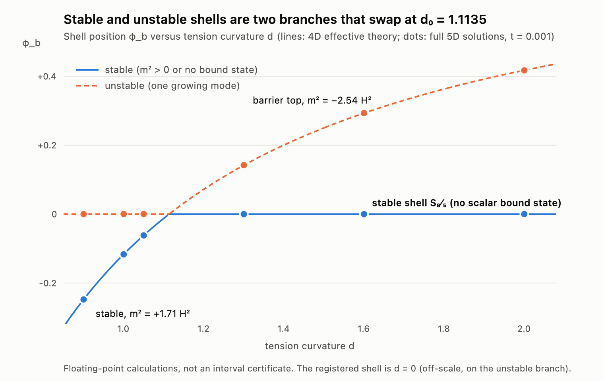

# HDBLAST Chat 10 — a certified stable shell, and how it is connected to the unstable one

18 September 2026 · Ricardo Maldonado's higher-dimensional blast research · prepared with Claude (Anthropic)

**Chat 9 showed that the registered de Sitter shell is unstable. This continuation supplies the constructive half: a
de Sitter shell that provably exists and provably has no unstable scalar mode, and a map of how stable and unstable
shells are related.** The proof is computer-assisted, in the same exact-arithmetic style as the project's earlier
certificates, and a skeptical referee re-ran it.

These are results about the registered five-dimensional model. They do not show that a higher-dimensional blast caused
the Big Bang, and they do not change Chat 9's conclusion that the shell's position mode alone does not produce a hot
universe. They give the programme a candidate universe that does not fall apart, which every later step needs.

Lines are the four-dimensional formula from Chat 9; dots are solutions of the full five-dimensional equations.
[Vector version](branches_orchestrator/SHELL_BRANCHES.svg).

## 1. The theorem

Take the registered bulk (`W = 1 − φ + φ³/3`) and a shell whose tension has a small curvature term,

    σ_t = 2W + t(1 + cφ + dφ²/2),   with exact parameters   t = 1/1000,   c = 5975949350280/10¹³,   d = 8/5.

Call this shell **S₈⁄₅**.

**(a) It exists.** A preconditioned Poincaré–Miranda test in outward-rounded integer arithmetic (2⁻³⁸⁴ fixed point,
29 gates, 7 seconds) proves that the regular cone-to-shell solution satisfies both junction conditions inside a box of
radius 2⁻¹⁰⁰ in the cone value and 2⁻⁸⁴ in the shell position:

| Quantity | Certified value |
|---|---|
| φ_h + 1 | 8.78437001888956254016 × 10⁻⁷ |
| shell position y_b | 8.22819172487514216035 |
| de Sitter radius ρ_b | 78.829059525442223738509 |
| brane Hubble² h | 1.60926405018629808237 × 10⁻⁴ |
| φ_b | −5.2155053891198384 × 10⁻⁵ |
| B = φ''/φ' + σ_t''/2 | +5.3186609914364 × 10⁻⁴ (positive; it was −2.68 × 10⁻⁴ on the unstable registered shell) |

**(b) Its scalar sector has no bound state at all.** For every solution in that box there is no normalisable scalar
mode with `m² < 9H²/4`: no tachyon, no zero mode, no massive bound state below the continuum. The certificate
(48 gates, about 2½ minutes) shows that the cone-regular solution has no zero on `(0, y_b]` and that the junction
mismatch stays below `−1.8065 × 10⁻⁴` for **all** real `μ² < 9/4` at once, a margin of at least 18%. Complex `μ²` is
excluded analytically because `B > 0`.

Part (b) assumes the linearised perturbation equations of Chat 9. Those were derived in two gauges, agree equation for
equation with Frolov–Kofman (2003), and were checked numerically against the full field equations to 10⁻⁹, but they
have not been verified symbolically. That is the largest remaining non-rigorous premise.

**Safe wording:** *S₈⁄₅ exists and its scalar sector is mode-stable, with no bound state below the continuum threshold
`m² = 9H²/4`.* Not claimed: uniqueness of the shell solution, full linear stability (the vector sector and the special
`μ² = −4` harmonics were not treated; the tensor sector was shown healthy only for the Chat 9 shell), or non-linear
stability.

Files: [existence/](existence/),
[stability_certificate/](stability_certificate/),
[referee report](REFEREE_CHECK.md).

## 2. The counting theorem behind it

[oscillation_theorem/OSCILLATION_THEOREM.md](oscillation_theorem/OSCILLATION_THEOREM.md)
proves, for this singular problem with the eigenvalue inside the boundary condition:

* if `B > 0`, every bound state has real `μ² > −4` and is simple;
* the number of bound states below any `μ*²` equals the number of zeros of the cone-regular solution plus a term fixed by
  the sign of the junction mismatch — which gives the finite test used in the certificate;
* if `B < 0` there is exactly one extra mode below `μ² = −4`. That is the Chat 9 tachyon (`μ² = −7.72`), now
  explained structurally: the sign of `B` decides it;
* the cone boundary term in the norm vanishes, closing a gap left open in Chat 9.

The count reproduces every known case (d = 0, 0.7, 1.0, 1.3, 1.4: one state; d = 1.6, 2.0: none). Self-adjointness and
completeness are cited from the literature (Walter, Fulton), not re-proved.

## 3. Two branches of shells

Done directly by the orchestrator, no agents
([BRANCH_STRUCTURE.md](branches_orchestrator/BRANCH_STRUCTURE.md)).
For every tension curvature `d` there are two static shells, one stable and one unstable; they exchange roles at
`d₀ = 1.1135`.

* Below `d₀` the wall-centre shell (the registered type) is the unstable hilltop and a stable shell sits on the throat
  side. Above `d₀` the wall-centre shell is stable and the unstable shell is the top of a small barrier.
* The Chat 9 four-dimensional formula predicted the second branch before it was looked for. All twelve predicted shells
  were then found in the full five-dimensional problem: positions to about 10⁻⁴, masses to 0.1–1%. Example, `d = 1.6`:
  predicted barrier top at `φ_b = +0.29302` with `m² = −2.5371H²`; five-dimensional solution `+0.29299`, `−2.53654`.
  This tests the formula far from where it was derived.
* S₈⁄₅ is therefore a false vacuum with a very low barrier (0.72% of its vacuum energy). Quantum escape over it is
  suppressed by about `e^{−7.27/t} = e^{−7270}` (four-dimensional Hawking–Moss estimate).
* Changing the tension slowly through `d₀` makes the shell slide smoothly along the stable branch; it does not produce a
  violent transition. The fast Chat 9 roll-off needs the shell to start on the hilltop or the tension to change abruptly.

These branch results are floating point, not certified.

## 4. Status

| Question | Status |
|---|---|
| Does a stable-type shell exist for exact parameters? | **Certified** (S₈⁄₅, Poincaré–Miranda) |
| Any scalar bound state below 9H²/4 on S₈⁄₅? | **Certified: none**, conditional on the linearised equations |
| Is the root unique; is the shell fully linearly / non-linearly stable? | Not established |
| Two-branch structure, 4D formula vs 5D | Confirmed in floating point at 12 shells |
| Hot Big Bang from this mechanism? | **Still no** (Chat 9); nothing here changes that |
| External novelty? | Not claimed; methods are standard (validated numerics, Sturm theory, holographic effective action) |

## 5. What to do next

1. **Symbolic verification of the linearised equations.** It is now the weakest link under both certificates (Chat 9's
   tachyon and this stability result). It needs a computer-algebra system, which this machine does not have installed.
2. **Vector sector and the `μ² = −4` harmonics** for S₈⁄₅, to upgrade "scalar mode stability" to linear stability.
3. **Five-dimensional non-linear evolution** of the Chat 9 roll-off (still the decisive calculation for the cosmology).
4. A person should open the key papers listed in the Chat 9 referee review and confirm the equation correspondences.

For Zenodo this supports a short, clearly labelled **existence-and-stability certificate** for S₈⁄₅, together with the
Chat 9 stability supplement. It supports no claim about the origin of the Big Bang. Nothing was published or sent, and
no original research file was modified.

## Reproduction

In ``: `python3 existence/REPLAY.py` (standard library only, ~15 s, includes a
negative control) and `python3 stability_certificate/REPLAY.py` (~5 minutes, includes a negative control). Branch
results: `branches_orchestrator/eft_branches.py`, then `branches_5d_check.py` (numpy; ~10 minutes; needs the Chat 9
folder 146 in place). The agents were independent AI reviewers, not external peer review. A few stale log files and one
duplicate figure could not be deleted by the sandbox and can be removed by hand.
