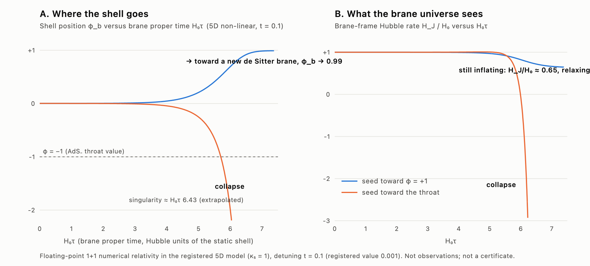

# HDBLAST Chat 13 — the full five-dimensional evolution of the roll-off: two fates, neither a hot Big Bang

21 September 2026 · Ricardo Maldonado's higher-dimensional blast research · prepared with Claude (Anthropic)

**Since Chat 9 the decisive open question has been physical: when the unstable shell rolls off its hilltop, what does
the full non-linear five-dimensional theory do?** Chat 9 could only answer inside a four-dimensional approximation.
This continuation answers it with a numerical-relativity code for the complete 5D Einstein–scalar system with the
mirror-symmetric shell as a moving boundary. The result confirms and sharpens the earlier negative conclusion:

* seeded toward `φ = +1`, the shell rolls for about six Hubble times and relaxes toward **another empty de Sitter
  universe**: its expansion rate falls monotonically, without oscillation, to 0.65 of the original value by the time the
  coordinates stop tracking it, within 1.3% of the exact Randall–Sundrum brane in the `φ = +1` vacuum — no radiation,
  no reheating;
* seeded toward the AdS throat, the brane universe's tension drops below its balanced value, its expansion **reverses
  and it collapses**: the classical evolution ends in a singularity about 0.44 Hubble times after the turnaround, with
  the scalar running away kinetically and the five-dimensional curvature at the brane growing by more than three
  orders of magnitude.

Within this homogeneous, classical evolution there is no branch in which the roll-off produces a hot, radiation-filled
universe. This is the model's own answer, computed without approximation beyond finite resolution, at tension
detunings of `t = 0.1` and `0.03` (the registered value is `0.001`; see the caveat in Section 4). It does not show that a higher-dimensional blast caused the Big Bang; it shows
that *this* mechanism, in *this* model, does not.

Left: shell position along the wall. Right: the expansion rate seen on the brane. Blue seed toward `φ = +1`, orange
seed toward the throat. [Vector version](HDBLAST_CHAT13_NONLINEAR_ROLLOFF_20260921/TWO_FATES.svg).

## 1. The calculation

**Equations.** In a two-dimensional conformal chart with flat three-space,
`ds² = e^{2B(t,z)}(−dt² + dz²) + e^{2A(t,z)}dx₃²`, the five-dimensional Einstein–scalar equations reduce to three wave
equations for `A`, `B`, `φ` plus two constraints, and the shell (kept at `z = 0`, bulk on `z < 0`) supplies Neumann
data through the Israel and scalar junction conditions. All of this was derived and checked exactly with the algebra
system ([derive_evolution_equations.py](HDBLAST_CHAT13_NONLINEAR_ROLLOFF_20260921/derive_evolution_equations.py)):
the static registered solution `B = ln ρ(z)`, `A = ln ρ(z) + t` satisfies every equation identically.

**Method** ([rolloff5d.py](HDBLAST_CHAT13_NONLINEAR_ROLLOFF_20260921/rolloff5d.py), numpy only, written directly by
the orchestrator). The code evolves the deviation from the static solution, so the static shell is static to round-off;
the system is nevertheless fully non-linear. Fourth-order finite differences, Runge–Kutta, Kreiss–Oliger dissipation,
ghost points for the junction conditions, a causally isolated far boundary. The seed is the exact static solution of a
slightly different tension slope (`Δc = ±10⁻⁴`), which satisfies the bulk constraints exactly.

**Validation.**

| Test | Result |
|---|---|
| Zero seed at `t = 0.1` | the shell stays static; round-off grows at rate 1.62694 |
| Linear theory (Chat 9 machinery) at `t = 0.1` | `μ² = −7.528262`, growth rate 1.62702 |
| Eigenvalues of the discretised operator | 1.6257 (dz = 0.004), 1.6266 (dz = 0.002) |
| Growth-rate fits of the seeded runs | 1.625–1.628 |
| Same at `t = 0.03` | 1.6462 (fit) vs 1.6484 (theory) |
| Two resolutions, `dz = 0.002` and `0.001` | `φ_b` at the end of the clean window 0.9906 vs 0.9908; `H_J/H₀` there 0.644 vs 0.649; turnaround at `H₀τ = 5.9909` vs `5.9912`, `φ_b = −1.9562` vs `−1.9566`; collapse converged to 1–2% until `H_J ≈ −5H₀`, not beyond |
| Referee runs: far boundary `L = 16`, seed ×10 and ×½, dissipation ×½ and ×2, alternative ghost closure | trajectories unchanged (seed-time shift 0.43 vs the predicted ln 2/s = 0.426; dissipation changes `H_J` by ≤3×10⁻⁵) |
| Momentum constraint (monitored, never imposed) | `≲10⁻⁴` through the roll at both resolutions; grows in the final collapse (2% at `dz = 0.001`, 8% at `0.002`) and in the frozen late-time window of the `+1` branch |

The linear regime is reproduced to 5×10⁻⁵ (control) and 10⁻³ (seeded runs); the roll-off itself moves by under 1%
between resolutions; only the last fraction of a Hubble time of the collapse is not converged. The scheme's constraint
violation scales as `dz²`, so it is effectively second-order accurate at the boundary.

## 2. What happens, in detail (`t = 0.1`)

**Toward `φ = +1`.** The shell leaves the hilltop, crosses the wall in about one Hubble time, and reaches
`φ_b = 0.991` by `t ≈ 10`, the domain wall receding into the bulk behind it at the speed of light. The brane-frame
expansion rate falls monotonically from `H₀` to `0.649 H₀` at `H₀τ = 7.3`, still decreasing slowly
(`dH/dτ ≈ −0.035 H₀²`) when the conformal chart freezes (`e^{B_b} ∝ e^{−t}`; the brane's proper time saturates at
`H₀τ = 7.39`). A de Sitter brane of this tension sitting in the exact `φ = +1` AdS vacuum (the Randall–Sundrum
configuration) has `H/H₀ = 0.638` at this `t`; Chat 9's four-dimensional effective theory gives 0.606 in the `t → 0`
limit of the same formula. The 5D value is within 1.3% of the exact configuration and still relaxing toward it; a
two-parameter fit of the late decrease as a redshifting `a⁻⁴` admixture lands on 0.637. Nothing oscillates and nothing
decays into radiation. The plateau is observed for only about a third of an e-fold before the chart fails, so the
asymptotic value is bounded above by 0.65 rather than measured; following it further needs a different time slicing.
The `t = 0.03` run behaves the same way (`φ_b = 0.996`, `H_J/H₀ = 0.63` and still falling at the freeze, against an
exact-vacuum value 0.616).

**Toward the throat.** The shell crosses `φ = −1` at `H₀τ = 5.70` with `H_J = 0.79 H₀` (4D theory: 0.797). Beyond
`φ_b = −1/c = −1.67` the detuning term of the tension, `t(1 + cφ_b)`, turns negative: the brane's tension falls below
its balanced value. At `H₀τ = 5.99`, with `φ_b = −1.96`, the brane's expansion reverses — Chat 9's four-dimensional
theory predicted the reversal at `−1.94`; the turnaround is converged across resolutions, seeds and dissipation
settings. (An earlier draft attributed the reversal to the bulk potential being unbounded below; that is wrong — at
the turnaround `U(φ_b) = +3.9`. The driver is the sub-balanced tension, and the subsequent runaway of `φ_b` is kinetic
domination in the contracting phase, `dφ_b/d ln a = −2`, of the kind found by Felder, Frolov, Kofman and Linde for
collapse in negative potentials.) The contraction proceeds through at least two e-folds; `H_J` passes `−5H₀` at
`H₀τ = 6.30` (converged to 1–2%) and `−40H₀` by `6.42`, with the five-dimensional curvature at the brane growing to
`2.6×10³` times the AdS₋ curvature before the record ends. A `1/(τ* − τ)` extrapolation places the singularity at
`H₀τ* ≈ 6.43`, about 0.44 Hubble times after the turnaround, but the coefficient and exponent of the final approach are
not converged (the two resolutions differ by a factor of 2–3 in `H_J` in the last 0.03 Hubble times), and whether it is a
four-dimensional crunch or a five-dimensional bulk singularity forming at the brane is not resolved.

**Reading.** The shell's position mode is the only unstable degree of freedom (Chats 9–12), and following it
non-linearly leads either to another vacuum or to a singularity. To obtain a hot universe the model needs an
ingredient that is not in it: brane matter with a derived coupling to the bulk scalar, or a potential with a minimum that
can trap the shell and let it reheat. Chat 9 estimated what such an ingredient would have to do; nothing here changes
those estimates.

## 3. Prior art

Non-linear evolution of unstable inflating branes with a bulk scalar was done for two-brane systems by Martin, Felder,
Frolov, Peloso and Kofman (*BraneCode*, hep-th/0309001), who found relaxation to a lower-Hubble state or a brane
collision with Kasner-like asymptotics. Collapse with kinetic-dominated scalar runaway in a negative potential is the
Felder–Frolov–Kofman–Linde scenario (hep-th/0202017); AdS-type crunches are discussed by Hertog and Horowitz
(hep-th/0406134). The outcomes here — relaxation to a lower de Sitter state on one side, a collapse on the other — are
of the same kind. No single-brane roll-off-to-collapse computation was found in a bounded search. The code, the single-shell-with-regular-cone setting and the specific model are the
project's own; the methods (conformal-gauge 1+1 relativity, Kreiss–Oliger dissipation) are standard. No novelty is
claimed.

## 4. Limits of the result

* **Detuning.** The runs use `t = 0.1` and `0.03`, not the registered `10⁻³`. At the registered value the code does
  not reproduce the linear growth rate (it returns 5, 4 and 2.2 at `dz = 10⁻³, 5×10⁻⁴, 2.5×10⁻⁴` instead of 1.657).
  The numerics referee's resolution scan shows the rates converging downward and the shell layer clean, with the
  remaining error a bulk front in the cone region: the cause is under-resolution of the wall, which is only 0.013
  wide in the conformal coordinate at `ρ_b = 79` (6–13 grid points), not a boundary-closure defect as first thought.
  The linear theory shows the tachyon mass depends only weakly on `t` (`μ² = −7.72 + 1.92t`) and the two detunings
  run agree with each other, so the qualitative fates are expected to persist; a computation at `t = 10⁻³` needs a
  stretched grid or a different radial coordinate.
* **Homogeneity.** The evolution is homogeneous on the brane (flat three-space, one spatial bulk coordinate). Patches
  rolling in different directions, bubble walls and gravitational radiation are not included.
* **Floating point.** Nothing here is interval-certified; the constraint is monitored, not enforced, and grows to a few
  percent in the final collapse and to order one in the frozen late-time window of the `+1` branch (which is why the
  plateau is quoted only up to `H₀τ = 7.3`).
* **Not addressed:** quantum seeds and the probability of each side, the `t = 10⁻³` case, brane matter, Kaluza–Klein
  modes and gravitational radiation, any observable.

## 5. Referee corrections

Two referee agents (numerics; physics and claims) re-derived the equations independently, reproduced the runs bit for
bit, ran thirteen further checks (far boundary, seed size and sign, dissipation strength, closure variant, a resolution
scan at `t = 10⁻³`) and confirmed the two fates. They found six overstatements in the first draft of this document, all
corrected above: the `+1` plateau was quoted as settled when it is still relaxing (and the chart freezes at
`H₀τ = 7.39`, not 8.3); a quoted estimate of 0.603 was a bug in the analysis script (the exact value is 0.638); the
`t = 0.03` "end state" had been cut off by a stop condition; the collapse was called a converged big crunch with a fitted
power law when only the turnaround and the early contraction are converged; the cause of the reversal was misattributed
to the unbounded potential; and the failure at `t = 10⁻³` was misdiagnosed as a boundary-closure problem. Their reports
are in [referee_numerics/](HDBLAST_CHAT13_NONLINEAR_ROLLOFF_20260921/referee_numerics/REFEREE_NUMERICS.md) and
[referee_physics/](HDBLAST_CHAT13_NONLINEAR_ROLLOFF_20260921/referee_physics/REFEREE_PHYSICS.md).

## 6. Status

| Question | Status after this checkpoint |
|---|---|
| 5D non-linear fate of the roll-off, `φ = +1` side | **relaxes toward the Randall–Sundrum de Sitter brane** in the `φ = +1` vacuum, `H ≤ 0.65 H₀` and within 1.3% of the exact value when the chart freezes; no oscillation, no reheating (floating point, two resolutions, two detunings) |
| 5D non-linear fate, throat side | tension drops below balance, **expansion reverses** at a converged point, **collapse to a singularity** ~0.44 Hubble times later; the final approach is not converged and the singularity's 4D/5D nature is open |
| Hot radiation universe from the roll-off | **No** for the homogeneous, classical, single-scalar, matter-free system — now at the full non-linear 5D level, not only in the 4D approximation |
| Registered detuning `10⁻³` | qualitative behaviour expected to be the same; not directly computed |
| Higher-dimensional origin of the Big Bang | **Not established**; this mechanism in this model is excluded as the sole cause |

## Reproduction

In `HDBLAST_CHAT13_NONLINEAR_ROLLOFF_20260921/` with the system `python3` (numpy):

    python3 rolloff5d.py --tdet 0.1 --dc 0 --dz 2e-3 --L 8 --tf 8 --tag runs/control        # ~1 min: static + round-off growth
    python3 rolloff5d.py --tdet 0.1 --dc 1e-4 --dz 1e-3 --L 12 --tf 12 --tag runs/plus      # ~7 min: toward φ = +1
    python3 rolloff5d.py --tdet 0.1 --dc=-1e-4 --dz 1e-3 --L 12 --tf 9 --phimin -40 --tag runs/minus   # ~4 min: crunch
    python3 analyse_runs.py                                                                   # growth rates, end states, crunch fit

The symbolic derivation needs the SymPy environment from Chat 11. `runs/ANALYSIS.json` holds the raw fit numbers (its AdS₊ estimate column omits an `O(t²)` term and is superseded by the values in Section 2; its `t01_plus` entry with `tf = 16` extends into the corrupted late window).
Nothing was published or sent; no original research file was modified.
