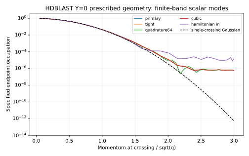
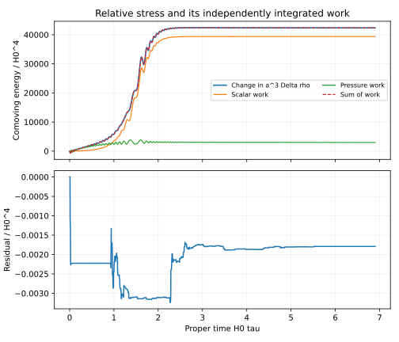

# HDBLAST: quantum modes and their energy exchange on an archived shell

**Executed result, 1 October 2026.** Scalar modes on the source-free expanding A1 shell reproduce the earlier corrected crossing count closely, while their relative stress and scalar current show contributions that a particle-only gas misses.

The ten registered numerical variants passed. The mode equations were also implemented independently in JavaScript/RK4: all 32 checked occupations agree with the Python/DOP853 calculation within 1.9e-11, and endpoint stress/current agree within 6.1e-8 in the stated units.

## What was calculated

One real minimally coupled spectator scalar has m_hat²=100²(phi−0.5)² on the archived tuned delta=0.1, Y=0 geometry. It evolves from proper time H0*tau=0 to 6.9. The momentum band and finite-time in/out states are specified in [REGISTRATION.md](REGISTRATION.md), committed before this round's mode integration.

This is a prescribed-background quantum-mode and relative-stress calculation. The result does not supply the absolute renormalized source, decay/thermalization, new bulk evolution or coupled shell backreaction.

| Finding | Value and scope |
|---|---|
| Count compared with the uncorrected Gaussian in the same band | 1.9544% lower |
| Count compared with the previously corrected estimate | 0.0503% lower, for this declared setup |
| Endpoint relative energy density | Delta rho/H0⁴ = 41.11687 |
| Endpoint relative scalar current | Delta J/H0⁴ = 84.61252; the particle-only estimate is 76.25371 |
| Coherent current contribution | 8.35882 H0⁴, or 10.96% of the particle-only estimate |
| Endpoint relative pressure | Delta p/H0⁴ = −4.38437; the particle-gas estimate is +0.07903 |
| Largest sampled paired-work residual, all ten variants | 1.73e-7, below the registered 1e-5 tolerance |
| High-momentum tail | Strongly dependent on the finite-time particle basis |
| Quantum extension of the shell action | Requires additional potential and intrinsic-curvature matching terms |

The endpoint relative stress is not a radiation fluid: Delta p/Delta rho≈−0.1066, while even the gas approximation has p/rho≈0.00192 because these particles are massive. Negative relative pressure is not a claim of negative absolute energy or an instability.

The corrected-count comparison is a local consistency result for one parameter choice. Initial-state changes affect the count by about 0.95% and affect the force more. It is not a validation of an entire mechanism or a general spectrum.

## Read, inspect and reproduce

- [Numerical results and sensitivities](NUMERICAL_RESULTS.md)
- [Stress/current derivation and state interpretation](STRESS_CURRENT_AND_STATES.md)
- [Shell EFT matching requirement](EFT_MATCHING_REQUIREMENT.md)
- [Targeted primary literature](LITERATURE_AND_RENORMALIZATION.md)
- [Independent audit and execution record](AUDIT_AND_EXECUTION.md)
- [Reproduction and download integrity](REPRODUCE.md)
- [Next physical calculation](NEXT_TESTS.md)
- [Machine-readable result](outputs/actual_modes.json)
- [Input hashes](INPUTS.json)

The figure compares specified finite-time occupations. The Gaussian is an approximation; neither curve establishes a UV-complete particle spectrum.

The work terms describe the difference between two states of the same operator, not the absolute energy available for a new cosmology.

Prepared under Ricardo Maldonado's direction with AI assistance and independent internal analytical/numerical checks. These are not external peer review. The September outcomes and the earlier 0.314-e-fold friction-model diagnostic retain their original scope. No external mathematical novelty or observational support is claimed.
