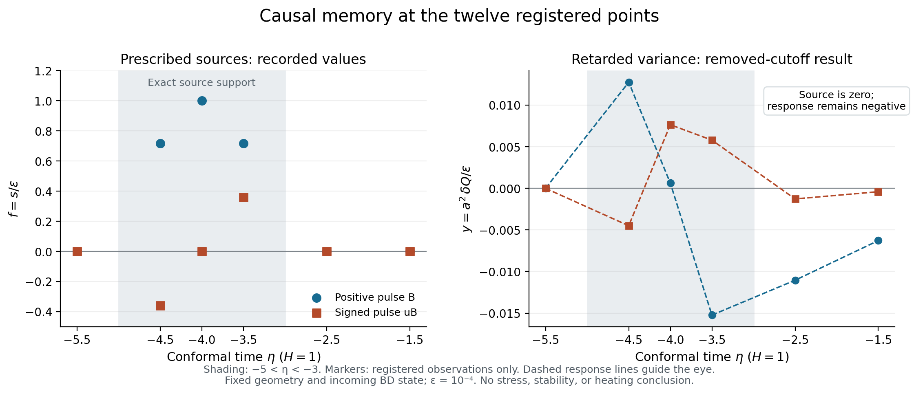

# HDBLAST: a registered causal quantum-response calibration

Ricardo Maldonado · 2 October 2026 · [ORCID](https://orcid.org/0009-0009-3937-6527)

This checkpoint checks a time-dependent quantum scalar response on a prescribed
de Sitter geometry. The independently evolved canonical modes agree with the
matched causal memory formula at all 36 registered finite-cutoff comparisons.
Both tested pulses retain the predicted negative response after their sources
vanish. The result supplies a checked scalar-response component for the research
program; it does not supply the stress or metric response needed for shell
evolution or establish heating.

## The declared test

Use de Sitter curvature units with `H=1`, fixed subtraction reference `r=2`,
minimal coupling, and the incoming Euclidean/Bunch–Davies state. At this exact
mass reference the canonical unperturbed modes are plane waves. The geometry
and initial state remain fixed while an external infinitesimal mass source is
applied. This is distinct from the actual finite-gamma stationary endpoint.

With `u=eta+4`, let `B(u)=exp(1-1/(1-u²))` inside `|u|<1` and zero outside.
The two sources are `s=a² delta x=epsilon B` and `epsilon uB`, with
`epsilon=1e-4`. They have support `-5<eta<-3`; initial time is `-6`, final
time `-1.5`. Six observations per pulse occur before, during and after support.
Finite momentum cutoffs are `K=64,128,256`. These are numerical regulators,
not physical EFT cutoffs. The choices are formal research inputs, not measured
parameters.

The reported comparison variable is `y=a² delta Q/epsilon`. The matched
removed-cutoff response is

```text
delta Q(eta) = -1/(8 pi² a(eta)²) integral s'(t)
              [ln(a(eta) sqrt(r) (eta-t)) + EulerGamma + 1] dt.
```

The finite local term follows from the inherited subtraction convention.
Dropping it or letting `r` vary changes the model. The one-sided finite-part
memory kernel and its state terms are established linear-response methods;
this checkpoint makes a project-specific calibration, not a novelty claim.

## Recorded evidence

| Check | Outcome |
|---|---|
| Registered pulse observations | 12 rows; 36 finite-cutoff comparisons pass |
| Independent real-time mode evolution | 4 pulse/resolution runs pass; mode data retained |
| Wrong-formula and state controls | 17 checks detected normally and under `python -O` |
| Exact symbolic theory | 46 identities and 14 wrong-formula checks pass normally and under `python -O` |
| Post-run independent archive audit | 72 reconstructed integrals, 24 stored Wronskians and 98,304 quadrature moments pass |
| Causality | Both pre-pulse responses are exactly zero |
| Post-pulse memory | Both positive and signed pulses have the predicted negative response |

The largest independent mode/finite-cutoff difference in `y` is
`6.94e-17`; the largest coarse/fine mode difference is `1.28e-16`.
These are observed agreements, not certified total error bounds.
At `K=256`, the largest difference from the removed-cutoff memory formula is
`1.145e-7`. Its separately computed analytic omitted-momentum bound is at
most `2.341e-6`. Directed interval arithmetic encloses that tail expression;
finite quadrature, arithmetic and integration errors retain their stated
empirical estimates and acceptance allowances. The complete response is not
a certified interval solution.

For the positive pulse, the post-pulse values of `y` are `-0.0110398935` at
`eta=-2.5` and `-0.00627782869` at `eta=-1.5`. For the signed pulse they are
`-0.00127426913` and `-0.000409000584`. The source and all its derivatives
vanish there, so these are history effects rather than a local instantaneous
source. Relative variance and coherence do not themselves give a radiation
energy density or a temperature.

See the [primary results](outputs/primary/results.json),
[independent mode results](outputs/independent/results.json),
[comparison checks](outputs/CHECKS.json),
[exact theory](theory/FROZEN_CAUSAL_THEORY.md), and
[reproduction instructions](REPRODUCE.md).

Read the [numerical report](outputs/NUMERICAL_RESULTS.md), [archive audit](review/POSTRUN_AUDIT.md) and [independent scientific review](review/INDEPENDENT_SCIENTIFIC_REVIEW.md). The figures use only registered points.



## Prospectivity, scope and next step

All 33 initial files were published at
`a01d17e015f070be2ad2018745e877148fe2f4e4` before the new causal response or
mode experiment. `FULL_REGISTRATION.json` preserves their 32 payload hashes.
The remote verification and actual run provenance are in
[PUBLIC_FREEZE_EVIDENCE.json](outputs/PUBLIC_FREEZE_EVIDENCE.json). No frozen
model, pulse, grid, gate or implementation was changed after these results.
An earlier symbolic-verifier development issue is recorded with the original
tool capture and an explicitly labeled reconstruction; its correction preceded
registration and changed no physical formula.

The [spectral-work note](theory/PROSPECTIVE_CAUSAL_SPECTRAL_WORK_NOTE.md)
derives a positive canonical excitation-energy functional and a distinct
background drift term in the inherited matched work. It is analytic only;
no energy yield or heating experiment was executed in this round.

The next bounded task is a matched fixed-geometry stress response and its
Ward/contact checks. A [post-run analytic proposal](theory/PROSPECTIVE_MATCHED_STRESS_RESPONSE.md) derives direct stress operators and their closed matched response, with explicit finite-cutoff contacts. It executes no new stress experiment and requires a separate public numerical registration. Its [separate exact proof](theory/MATCHED_STRESS_PROOF_REPRODUCE.md) passes 21 identities and eight mutation controls normally and under optimization, with seven inherited-source hash checks; this is analytic follow-up rather than a stress numerical result. General metric response, the propagator at the actual
stationary endpoint, bulk perturbation conditions and quantum initial data
remain necessary before quantum stability or coupled evolution can be tested.
Internal AI-assisted reviews are not external peer review. A successful
calibration provides no observation supporting extra dimensions or the
origin of the Big Bang. See [claims and next steps](review/CLAIMS_AND_NEXT_STEPS.md)
and the [targeted literature review](literature/LITERATURE_REVIEW.md).
