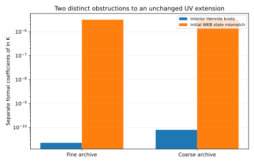
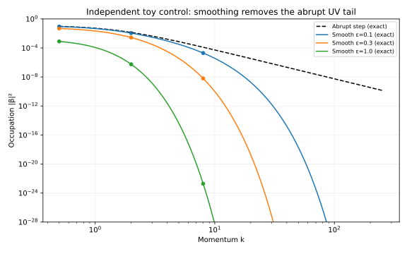
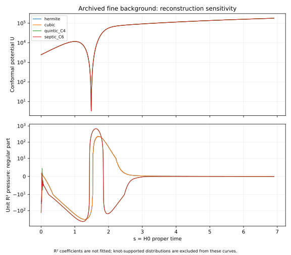

# HDBLAST: curved-source readiness and ultraviolet regularity

**Decision: the numerical controls pass; the archived finite-band surrogate is not ready for an unchanged absolute curved-source calculation.** This is a reproducible diagnosis and a tested subtraction construction, not a hot Big Bang, a new 5D solution, or observational support for the hypothesis.

Prepared 1 October 2026, America/Los_Angeles. The directory uses 2 October UTC. Ricardo Maldonado; AI-assisted calculations and internal review are disclosed and are not external peer review.

## What this round establishes

1. The archived C1 Hermite geometry has resolved conformal-potential jumps. Their formal infinite-band extension produces a logarithmic excitation-energy tail. The unchanged amplitude-WKB initial state has a separate curvature mismatch with a larger logarithmic coefficient.
2. Smooth C4/C6 reconstructions remove those low-order knot jumps, but do not fix the initial state or establish physically accurate high derivatives. The two fits differ by 103.9207 in the regular pressure variation of a **unit** R² action, about 15.33% of the sampled C4 maximum. This is a diagnostic, not a quantum-pressure measurement or an error bar on the hypothesis.
3. A positive-reference FRW subtraction construction passes 72 exact-rational graded exchange checks and 36 flat-reduction checks, including deliberately broken controls. These are selected-jet checks, not a universal proof or an evaluated FRW source.
4. Nine independent complex DOP853 and nine real Radau oscillator evolutions agree with the exact smooth-step spectrum. A post hoc smoothing-width calculation approaches the predicted logarithmic coefficient as the width tends to zero.

All eight reconstruction continuity checks pass after correcting the numerical representation. The first compilation failure and the original higher-degree continuity failure are retained; no registered threshold was relaxed.

## Read and reproduce

- [Measured results](NUMERICAL_RESULTS.md), [machine-readable summary](RESULTS_SUMMARY.json).
- [Knot/state derivation](THEORY_REGULARITY.md), [curved subtraction](FRW_COUNTERTERMS.md).
- [Execution, review and protocol deviations](AUDIT_AND_EXECUTION.md), [preserved numerical repair history](NUMERICAL_REPAIR.md).
- [Reproduction](REPRODUCE.md), [input provenance](INPUTS.json), [prospective registration](REGISTRATION.md), [pre-execution addendum](PROTOCOL_ADDENDUM.md).
- [Focused literature update](LITERATURE_REVIEW.md), [methods screened from other projects](CROSS_PROJECT_SCREEN.md).
- [Next experiment](NEXT_EXPERIMENT.md), [publication status](PUBLISHING.md).
- [Self-contained scientific ZIP](HDBLAST_CHECKPOINT_20261002_FRW.zip), with source, original research inputs, curated outputs, figures and SHA-256 manifest.

## What remains unresolved

An admissible global state, controlled smooth background/prehistory, common-action finite curvature matching, absolute renormalized stress/current, coupled shell backreaction, decay and thermalization remain to be established. The previous finite-band relative calculation and flat-pulse benchmark retain their stated scope. This audit diagnoses their extension requirements; it does not retroactively turn those limited calculations into a radiation-era claim.
