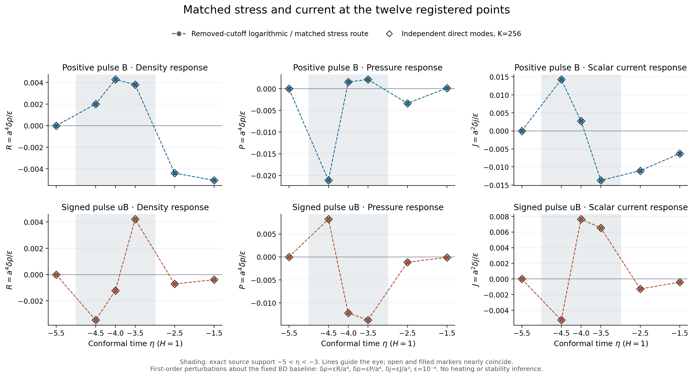

# HDBLAST: registered matched minimal stress response

Ricardo Maldonado · 2 October 2026 · [ORCID](https://orcid.org/0009-0009-3937-6527)

Independent forced modes reproduce the matched energy-density and pressure
response for both registered smooth mass pulses on prescribed de Sitter
geometry. All 180 core comparisons pass, together with finite-cutoff trace,
contact, current and energy-conservation checks. This supplies a tested
scalar-to-stress component of the research program. Metric response, the
actual shifted stationary-root propagator and coupled shell evolution remain
open; this experiment establishes no heating or Big-Bang mechanism.

## Model and prospectivity

The geometry is fixed: `H=1`, `a=-1/eta`, minimal coupling, subtraction
reference `r=2`, and unchanged incoming Euclidean/Bunch–Davies state.
Let `u=eta+4` and `B=exp(1-1/(1-u²))` inside `|u|<1`, zero outside.
The external mass sources are `s=a² delta x=epsilon B` and `epsilon uB`,
with `epsilon=1e-4`. Six observations per pulse are registered at
`eta=-5.5,-4.5,-4,-3.5,-2.5,-1.5`, with momentum regulators `K=64,128,256`.
These cutoffs are numerical regulators, not physical EFT scales.

All 85 payload files, plus their [registration](FULL_REGISTRATION.json),
were public at `4a5dad8dda6d0a57a9cf88cc8b4a9b8feeaea45d` before either
new physical calculation. [Remote verification](outputs/PUBLIC_FREEZE_EVIDENCE.json)
matches GitHub and local bytes. Sources, implementations, grids, gates and
budgets remain unchanged. The original producers and validators all pass;
the archive also preserves the separate pre-freeze symbolic development typo
and its failed log.

The first route integrates the retarded variance memory and its derivatives,
then evaluates the independently derived minimal stress/contact expressions.
The second evolves complex forced canonical modes in extended precision and
calculates **both density and pressure directly** from the physical minimal
operators, explicit mass contacts, and complete inherited W2/W4 subtraction.
A separate Simpson Ward ledger is integrated from saved direct stresses;
neither stress is defined by that ledger. This is an established-method
calibration at an exactly solvable reference, not a claim of new fundamental
mathematics.

## Evidence and physical interpretation

| Check | Original result, normal and optimized Python |
|---|---|
| Core variance derivatives, density and pressure | 180 comparisons pass |
| Reference variance, anomaly and scalar current | 108 comparisons pass |
| Direct mode stresses versus closed expressions | 72 comparisons pass |
| Finite-cutoff trace | 36 comparisons pass |
| Raw mode reconstruction | 72 observation/cutoff points pass |
| Ward ledger | 72 endpoints reconstructed; 36 fine endpoints gated, plus 36 ledger refinements |
| Core resolution refinement | 180 comparisons pass |
| Removed-cutoff comparisons and separate tail budgets | 288 comparisons pass |
| Operator/contact and synthetic guard controls | 20 detected; their distinct scopes are recorded |

Maximum normalized density disagreement is `4.51e-17`; pressure disagreement
is `6.24e-14`. Fine-ledger endpoint disagreement is at most `1.99e-10`, and
coarse/fine ledger disagreement is at most `1.27e-7`. These are numerical
agreements, not certified total error bounds. Directed interval arithmetic
encloses the actual omitted momentum bands, including stress derivatives and
contacts. Quadrature, refinement, floating-point cancellation and ledger
discretization retain separate estimates and allowances.

Density and pressure are reported as `R=a⁴ delta rho/epsilon` and
`P=a⁴ delta p/epsilon`. After the sources vanish, both pulses leave negative
**relative first-order density response**. The positive pulse has
`(R,P)=(-0.00439300,-0.00337685)` at `eta=-2.5` and
`(-0.00506845,+0.000128627)` at `eta=-1.5`. The computed pressure has opposite signs
at those observations. Its positive late value is smaller than the
conservative K=256 pressure-tail bound; this is numerical evidence, not an
interval-certified sign crossing or a universal equation of state.
This coherent vacuum polarization neither determines the sign of total
baseline energy nor represents an emitted thermal fluid. Positive quadratic
canonical excitation energy requires a separate second-order calculation.

Read the [numerical report](outputs/NUMERICAL_RESULTS.md),
[primary result](outputs/primary/results.json),
[independent result and raw archives](outputs/independent/results.json),
[checks](outputs/CHECKS.json), and [reproduction instructions](REPRODUCE.md).
The [tail review](review/TAIL_MODULE_STATIC_REVIEW.md) and
[independent archive audit](review/POSTRUN_AUDIT.md) and
[bounded literature review](literature/LITERATURE_REVIEW.md) document internal
cross-checks and primary-source provenance. Internal AI-assisted reviews are
not external peer review.

The figure uses the twelve registered points. Lines guide the eye; the
comparison does not introduce new time samples.

The [analytic follow-up proposal](theory/second_order/00_READ_FIRST.md) passes
21 exact identities and eight mutation controls, with nine faithful reference
inputs and an independent formula review. It is unregistered and performs
no numerical energy experiment. The next tractable calculation requires a
separate public registration of positive
second-order canonical excitation energy and its matched source-work/drift
ledger. General metric kernels, actual-root response, physical matching,
bulk conditions and quantum initial data remain prerequisites for coupled
evolution and quantum stability. No observation supports extra dimensions
or the origin of the Big Bang here. Prepared Zenodo metadata is not a deposit
or new DOI.
