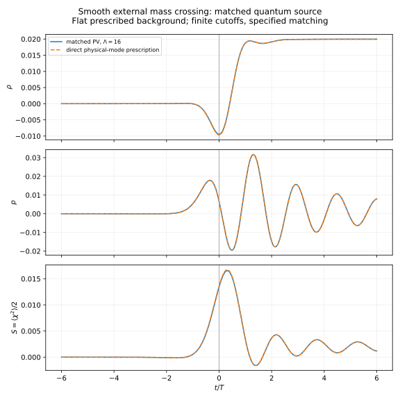
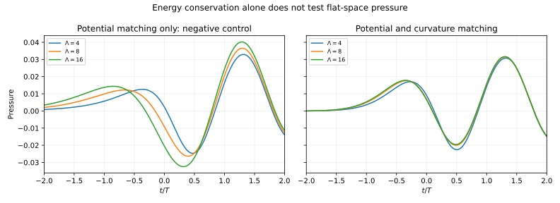
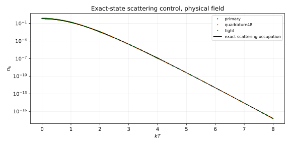

# HDBLAST: matched quantum-source benchmark — 2 October 2026

**Result:** eight registered flat-background calculations pass their declared controls. A common-action prescription supplies an absolute quantum energy, pressure and mass-squared current through a zero-mass crossing in a fixed finite matching convention. The pressure needs a curvature counterterm even though the background is flat. Potential-only subtraction passes energy conservation while giving regulator-dependent pressure.

This is a prerequisite for the HDBLAST matter calculation. It does **not** establish a higher-dimensional blast, shell backreaction, thermalization or a hot Big Bang. No external mathematical novelty or observational confirmation is claimed.

## What was actually calculated

A real scalar has x(t)=M²(t)=4 tanh²(t), with an exact asymptotic incoming state, on Minkowski spacetime. Potential and curvature matching are fixed at the asymptotic reference x=4. One-loop sources follow from the same local action. Pauli–Villars (PV) regulator weights cancel the required UV moments; the regulator scale is not the five-dimensional gravity scale and regulator fields are not physical species.

At the zero crossing, the primary finite-regulator calculation gives:

| Quantity | Lambda=16, K=128 |
|---|---:|
| Energy density rho | -0.0094394883 |
| Pressure p | +0.0065477090 |
| Current S conjugate to x=M² | +0.0134528976 |
| Pressure if the curvature matching term is omitted | -0.0205254361 |

S=Q/2 where Q is the matched field square. For x=4(phi-phi_*)², the scalar force is J_phi=8(phi-phi_*)S and vanishes at the crossing. Negative matched energy includes the chosen finite vacuum potential; it does not imply negative-energy particles.

## Evidence and limits

The eight cases vary regulator, momentum cutoff, quadrature, ODE tolerance and state preparation. Exact scattering, Wronskian, energy/work, an independent finite-difference pressure trace, and 70-digit analytic checks pass. The source code and prospective protocol were committed before execution. The audit records the actual runs and hashes.

Finite-regulator changes remain several percent relative to the crossing sources. A direct physical-mode representation of the same formal regulator-removed prescription has the expected 1/K² cutoff convergence. It uses the same physical mode solutions, so it is a check of subtraction and matching, not a second ODE solver. Its exact finite-K trace relation and leading UV tails were derived and checked after the registered experiment; they do not alter its thresholds.

At late times the energy agrees with the exact particle spectrum, but the particle gas has p/rho about 0.0704 rather than 1/3, and the full pressure retains coherence. This is not a radiation bath.

## Read or reproduce

- [Numerical results](NUMERICAL_RESULTS.md), [execution and audit](AUDIT_AND_EXECUTION.md), and [curated summary](RESULTS_SUMMARY.json).
- [Theory and matching](THEORY_AND_MATCHING.md), [direct-cutoff appendix](DIRECT_CUTOFF_APPENDIX.md), and [curved-background action bridge](FRW_ACTION_BRIDGE.md).
- [Prospective registration](REGISTRATION.md) and [pre-execution addendum](PROTOCOL_ADDENDUM.md).
- [Reproduction instructions](REPRODUCE.md) and [complete scientific ZIP](HDBLAST_CHECKPOINT_20261002_PV.zip).
- [Five-paper literature review](LITERATURE_20261002.md), including two relevant 2026 papers; this is a targeted search, not a survey of the entire web.
- [Next calculation](NEXT_TESTS.md) and [publication status](PUBLISHING.md).

Prepared with AI assistance under Ricardo Maldonado's direction. Internal computational reviews are not external peer review. Earlier HDBLAST verdicts retain their original scope.
