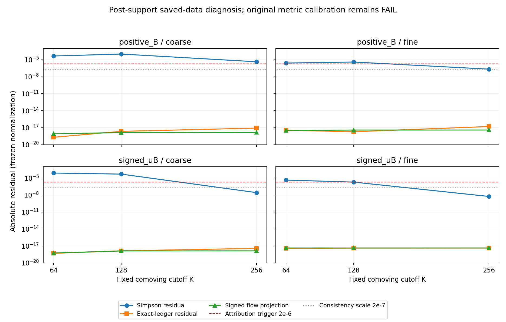

# Source-free ledger diagnostic: measured result

**LEDGER_ERROR_DEMONSTRATED.** All twelve saved-data consistency cases pass.
Eight meet the prospectively fixed gate-scale attribution criterion: Simpson
integration produces a conservation residual greater than 2e-6, while the
independent exact free-flow antiderivative accounts for at least 90% of it.
The previous metric calibration remains **FAIL**, including its 59 failed
endpoint/refinement checks. This diagnosis changes no historical verdict.

The largest absolute Simpson residual is 1.02863406e-04; the largest continuous
ledger residual is 1.61796600e-17. The maximum density/pressure profile
differences are 5.59348928e-17 and 5.00207870e-17,
and the largest signed mode-flow projection is4.51245750e-18, all below
the unchanged 2e-7 consistency scale. The numerical normalization and interval
are exactly those in the frozen protocol. These are empirical finite-calculation
results, not certified bounds on physical trajectory error.

## What was fixed and what was measured

Public freeze[`06984aa6b142499c592850e6b4afd49c28ced394`](https://github.com/maldonado-research/HDblast/commit/06984aa6b142499c592850e6b4afd49c28ced394)
and registration SHA256`e7a8fe5f6991bad9304440b037ce2eefafdfbaf9c011e177eb9b364b3239bba1` precede every new
physical diagnostic evaluation. All 121 frozen files were checked against the
public Git tree, with the registration independently downloaded. Input capsules
preserve all 68 selected NPY member byte strings from four prior failed archives.

The single interval is[-2.5,-1.5], after both source histories have ended.
Every 129 coarse and 257 fine profile sample is used at K=64,128,256. Both
implementations run all 12 cases at 80 and 100 decimal digits. The primary uses
integer Fourier moments; the independent implementation uses MPF moment sums
and retains every endpoint mode defect. They share the continuum model,
saved trajectories and momentum quadrature. Their agreement checks numerical
implementation, not independently established physics.

The canonical ledger is an analytic phase antiderivative of the expanded
integrand from the retained anchor state. It is not defined by measured final
density. The separately recorded recurrence primitive agrees with this direct
phase evaluation at each precision. Original Simpson global prefixes are
subtracted in long double; the reset and same-fine-history doubled-step controls
remain separate outputs.

## Signed residuals

`D_S=DeltaR-S_ab`, `D_cont=DeltaR-I_ab`, `E_Q=I_ab-S_ab`.
The signed identity `D_S=D_cont+E_Q` closes at the registered 1e-12 scale.
Rounded display values are below; [CASE_TABLE.csv](CASE_TABLE.csv) and the raw
diagnostics preserve long decimal strings. No case was dropped or retuned.

| Source | Resolution | K | D_S | D_cont | E_Q | Gate-scale attribution |
|---|---|---:|---:|---:|---:|---|
| positive_B | coarse | 64 | 4.630622e-05 | -1.988139e-19 | 4.630622e-05 | yes |
| positive_B | coarse | 128 | 1.028634e-04 | 2.253981e-18 | 1.028634e-04 | yes |
| positive_B | coarse | 256 | 4.451942e-06 | -8.447594e-18 | 4.451942e-06 | yes |
| positive_B | fine | 64 | 2.629431e-06 | -3.592093e-18 | 2.629431e-06 | yes |
| positive_B | fine | 128 | 3.998724e-06 | -1.910987e-18 | 3.998724e-06 | yes |
| positive_B | fine | 256 | -2.208805e-07 | -1.617966e-17 | -2.208805e-07 | no |
| signed_uB | coarse | 64 | 7.932652e-05 | -5.083036e-19 | 7.932652e-05 | yes |
| signed_uB | coarse | 128 | 5.101877e-05 | -1.416640e-18 | 5.101877e-05 | yes |
| signed_uB | coarse | 256 | -2.737233e-08 | -3.817586e-18 | -2.737233e-08 | no |
| signed_uB | fine | 64 | 4.506056e-06 | -3.911881e-18 | 4.506056e-06 | yes |
| signed_uB | fine | 128 | 1.976593e-06 | -4.298419e-18 | 1.976593e-06 | no |
| signed_uB | fine | 256 | -5.737443e-09 | -4.390510e-18 | -5.737443e-09 | no |

The four cases without a witness pass consistency but do not cross the strict
2e-6 attribution trigger. In particular the signed-source fine K128 residual
remains below that threshold; the threshold was not moved to include it.

## Independent arithmetic and actual resources

The largest common-field cross-route difference is
7.65853e-73, below 1e-12.
All reported precision-gap, direct/recurrence primitive, streamed flow-prefix,
serialization and signed-decomposition checks pass. Normal and optimized
validators give identical substantive reports. [The validation receipt](../outputs/original/fresh/validation/VALIDATION.json)
and [execution records](../outputs/original/EXECUTION.json) retain the evidence.

| Complete route, both precisions | Outer wall seconds | Peak RSS KiB |
|---|---:|---:|
| primary | 92.755 | 56,832 |
| independent | 265.776 | 57,128 |

Each route has its own single 900-second/262144-KiB allowance for all cases and
both precisions, including provenance and output serialization. No budget is
reset per case. These are observed execution resources, not synthetic estimates.

## What this establishes and what remains open

The stored source-free stress and free mode flow agree to very small numerical
residuals, while the sampled-history integration accounts for the large tested
conservation discrepancy. This is a useful diagnosis of the computational
pipeline. It is not a new law of nature or a claimed mathematical first.

The calculation does not test the active-source interval, the accumulated
earlier global ledger, initial-state accuracy, complete momentum error, the
actual shell root/lapse/bulk/state response, coupled dynamics or heating.
It therefore cannot explain all 59 original failures by itself, validate the
higher-dimensional blast hypothesis, or establish a hot Big Bang.

The next useful experiment is a separately registered active-source calculation
with a phase-aware time integral and independently derived density/pressure.
It must retain the old tolerances, inspect source-local matching/contact terms,
and test both time and momentum refinement. A source defined retrospectively
to enforce conservation would not be an independent check. Only a complete
successful registered calibration should precede coupled-evolution claims.

The bounded literature review covers 85 returned metadata records and selected
passages in four retrieved primary papers, with retrieval failures and coverage
limits retained. [Research context](../literature/LEDGER_RESEARCH_CONTEXT.md)
connects the exact antiderivative to established oscillatory quadrature methods;
it supplies no new evidence for extra dimensions. No claim to search the entire
web or establish fundamental mathematical novelty is made.

All review here is internal and AI-assisted. Standalone package replay and
hosted execution have separate publication receipts; their success must be
checked rather than inferred from this original run. Zenodo transport remains
blocked as documented in the publication handoff; this report creates no DOI.

The [post hoc Simpson frequency note](../evidence/posthoc_frequency/POST_HOC_SIMPSON_FREQUENCY_NOTE.md) derives the standard pure-harmonic response and its alias exceptions. Its 31 exact checks and 10 fabricated examples pass in both Python modes. It is explanatory and supplies no added acceptance criterion or quantitative certificate for the actual varying-envelope ledger.
