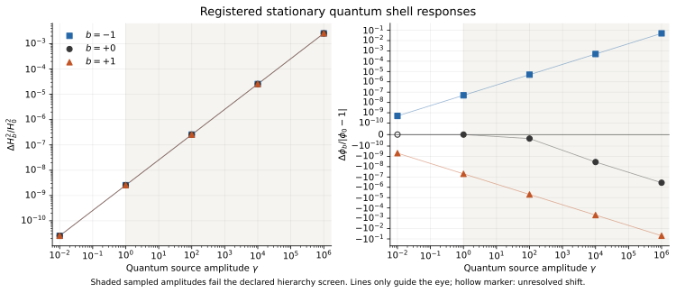

# HDBLAST: stationary quantum shell closure with paired de Sitter sources

Ricardo Maldonado · 2 October 2026 · [ORCID 0009-0009-3937-6527](https://orcid.org/0009-0009-3937-6527)

This checkpoint solves a stationary semiclassical shell problem using both
quantum sources from the inherited free-field de Sitter action. It obtains a
bounded local numerical solution family with the original quadratic matter
interaction, updating the sources as the shell endpoint moves. Nonlinear
feedback is resolved at the largest registered amplitude. That amplitude
fails the separately declared gravitational hierarchy screen, so this is a
formal mathematical closure result with no established controlled physical
EFT interpretation.

## Model and equations

There is one canonical free, minimally coupled massive shell scalar in the
Euclidean/Bunch–Davies de Sitter state. With `z=H²` and `eta=phi−1`, the
dimensionless family fixes

```text
x = r [1 + b(eta − eta0)/2]²,
r = 0.00011848029588657912 = 2H0²,
eta0 = −0.00008405268308670538,
b = −1, 0, +1,
gamma = 0, .01, 1, 100, 10000, 1000000.
```

For `b=±1` this is the original quadratic interaction with `m0=0`,
`Ghat=sqrt(r)/2`, and `phi_chi=1+eta0−2/b`; `b=0` has constant mass squared
`r`. The parameters are declared research choices. The reference `r` remains
fixed during all variations and root solves. Positive gamma means
`gamma=kappa5²/L³` with explicit `N=1`; gamma zero is the disabled-source
classical control.

The fixed-reference action density `W` gives

```text
Q = 2 W_x,       rho = W − z W_z/2,       p = −rho,
j = x_phi Q/2,  x_phi = b r [1+b(eta−eta0)/2],  x_phiphi = b²r/2.
```

The regular bulk and both junctions, `q=(sigma+gamma*rho)/6` and
`w=−(sigma_phi+gamma*j)/2`, are solved together on the inherited positive-q
branch. The full Jacobian includes curvature feedback and the action Hessian,
including the `x_phiphi*Q/2` term in `j_phi`. The scalar current is not generally
the scalar derivative of the density. All finite local matching remains as
declared in the inherited action.

## Results and their numerical scope

The producer completed all 48 registered integration/root cases and all three
wrong-model control solves, with no solver failures and one retained rejected
Newton trial. Corrected validation passes 1,584 gates on those unchanged
outputs. The initial validator's implementation failure is disclosed below.

All 15 positive-gamma curvature shifts are resolved under the registered
empirical criterion. Fourteen scalar shifts are resolved; the scalar shift
for `b=0, gamma=.01` is unresolved. A departure from archived linear response
is classified as resolved only at `gamma=1000000`, for all three slopes and
both observables. The table shows that largest amplitude; scalar differences
are computed in the shifted coordinate eta so tiny changes are retained.

| b | Delta phi | Delta H²/H0² | Nonlinear fraction of scalar shift | Nonlinear fraction of H² shift |
|---:|---:|---:|---:|---:|
| −1 | +4.19230221e−6 | +0.00257309753 | 0.00582766 | 0.00766733 |
| 0 | −3.01975675e−11 | +0.00257304746 | 0.00764309 | 0.00764798 |
| +1 | −4.19238325e−6 | +0.00257309775 | 0.00583258 | 0.00766733 |

Thus H² increases by about 0.25731% at the largest amplitude, with a nonlinear
departure around 0.765–0.767% of that shift. These figures describe the
declared formal model. Shifts use each resolution's own solved gamma-zero
control. Detection requires ten observed refinement spreads plus a fixed
floating-point floor; nonlinear detection additionally requires at least
0.1% of the observed shift. This is an empirical resolution rule, not a
rigorous error enclosure.

The separate tenfold hierarchy screen requires
`Ehat*gamma^(1/3) <= 0.1`, where `M5 L=gamma^(−1/3)` for positive gamma.
`Ehat` includes H, mass, endpoint `abs(q)`, and sampled intrinsic bulk
curvature scales. Among the registered positive amplitudes, only `.01`
passes, for every slope; no nonlinear departure is resolved there. All
`gamma>=1` rows fail this declared screen. At `gamma=1000000`, the ratio
is about `11.1378`. This sampled diagnostic is not a proved cutoff or a
sufficient test of EFT control. The gamma-zero record represents a
computational control, not a measured Planck hierarchy.

See [the complete numerical report](outputs/summary/NUMERICAL_RESULTS.md),
[raw producer outputs](outputs/primary/results.json), and
[corrected checks](outputs/primary/CHECKS_v2.json) for all cases, source
derivatives, residuals, controls and detection classifications. Wrong-model
roots that flip the current, omit the metric source or freeze the paired
sources all fail the correct equations by the registered margin.



## Independent checks and exact theory

| Component | Recorded outcome |
|---|---|
| Primary numerical validation | 48 roots; 1,584 gates pass; 3 wrong-model controls detected |
| Exact symbolic verification | 51 identities pass; 20 wrong formulas detected, normally and with `python -O` |
| Independent acceleration integration | 12 roots pass; independent interior constraint monitor and refinements pass |
| Independent proper-time sources | 8 endpoint evaluations; 48 source, refinement, trace and tail gates pass |
| Post-run independent comparison audit | 564 gates pass, including 48 source/Hessian rows, 6 endpoint comparisons and 3 wrong-root reconstructions |

The independent radial code evolves a second-order acceleration system and
monitors the Hamiltonian constraint rather than algebraically imposing it.
It starts from inherited classical coordinates and its own continuation.
Separate direct proper-time metric and scalar integrals check four nonzero
independent endpoints at two fixed settings. The largest normalized source
discrepancy is below `3.09e−18`; the largest selected cross-method H² difference
is below `1.25e−17`. These comparisons supply empirical evidence at the
specified gates. Analytic series, spectral and infrared tail bounds do not
jointly certify quadrature, ultraviolet truncation, arithmetic or radial
integration errors.

The [theory derivation](theory/STATIONARY_COMMON_ACTION_MODEL.md) also gives a
mass-zero obstruction for the quadratic interaction. At fixed positive H,
`Q ~ 3H⁴/(8pi²x)` implies
`j ~ 3H⁴/[8pi²(phi−phi_chi)]`. The vanishing mass derivative at `phi_chi` does
not remove the divergent current. The registered local positive-mass domain
excludes this point; a simultaneous H-to-zero limit or another state requires
a separate analysis.

## Prospective record and retained failures

All 18 initial checkpoint files were published at
[`b4f77f5826e0a603400513832aa53b0673df7533`](https://github.com/maldonado-research/HDblast/commit/b4f77f5826e0a603400513832aa53b0673df7533)
before any new quantum-source or radial/root calculation in this round.
The full registration has 17 file entries plus the manifest itself. The
symbolic work preceded that publication and is identified as symbolic only.
The scientific baseline is `e24643d579f7560db719775b2998c0ffa22898b0`.

The [original validator report](outputs/primary/CHECKS.json) is retained with
`FAIL`: a diagnostic keyword `condition=` collided with the positional
argument of its `gate` helper, producing 48 TypeErrors. The separately named
v2 validator changes only that keyword to `condition_number=`. The repair was
published as `d8a0b28fa7440215108ddfff51355816c932b541` before the successful
v2 validation. No source/root output, scientific gate, grid or model was
changed. This is a disclosed post-run implementation repair.

The separate post-run comparison audit initially failed to serialize a NumPy
boolean to JSON. Its original script, log and exit record remain under
`independent/`; the passing v2 audit corrects JSON scalar types
and adds portable arguments without altering the comparisons. The frozen
independent root and proper-time calculations passed with their original
sources. The [independent review](independent/INDEPENDENT_STATIONARY_REVIEW.md)
distinguishes those runs from later audits and documents all limitations.

## Use and next steps

This is stationary free-field vacuum backreaction in a specified local
mathematical family. It does not prove uniqueness, dynamical or quantum
stability, attraction, time evolution, particle production, thermalization,
heating, or a hot Big Bang. Self-consistent one-loop source feedback does not
calculate all two-loop physics. Physical mass and gravitational scales, a
controlled EFT hierarchy, and causal response remain separate work.

The separate derivations and implementations were produced within this
AI-assisted workflow; they are internal cross-checks, not external peer
review or independent human replication. The [literature review](literature/LITERATURE_REVIEW.md)
and [dimensional screen](literature/EFT_DIMENSIONAL_SCREEN.md) provide context
without a novelty or priority claim. This checkpoint depends on the inherited
DESITTER work in [PR #14](https://github.com/maldonado-research/HDblast/pull/14).

Read [claims and next steps](CLAIMS_AND_NEXT_STEPS.md) and
[reproduction](REPRODUCE.md). Reproduction requires the pinned inherited
inputs in a full HDBLAST checkout; a checkpoint-only ZIP is not self-contained.
Citation and deposition metadata are prepared, with no new DOI or completed
Zenodo deposition claimed. Text and data use CC BY 4.0; code uses MIT under
[LICENSE.md](LICENSE.md).

The [prospective causal-response protocol](theory/PROSPECTIVE_CAUSAL_RESPONSE_PROTOCOL.md) derives a matched real-time variance kernel at the exact reference and its stationary limit. This is analytic preparation for a future experiment; no causal numerical test or stability calculation has been performed.
