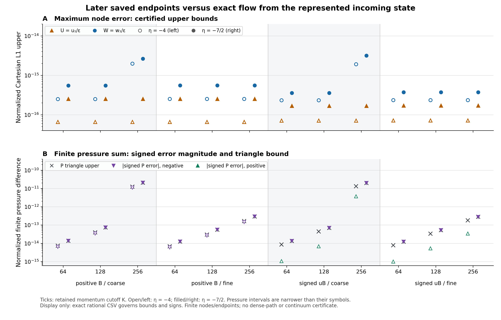

# Certified later-endpoint errors and the physical-model limit

8 October 2026. The later retained states are now enclosed against the exact
scalar evolution from their **exact represented incoming state** at η=−9/2.
Coverage is 49,152 retained node occurrences and 98,304 endpoint comparisons at
η=−4 and −7/2. The two sources, two grids, three cutoffs K=64,128,256 and two
endpoints give 24 reported rows. Their largest normalized Cartesian L1 error
uppers satisfy **max ‖ΔU‖₁ < 2.520E-16 and max ‖ΔW‖₁ < 3.158E-15**.

The target is the same prescribed scalar dynamics, U′=W and W′=2ikW−g, started
from the retained incoming coordinates. The discrepancy is **saved endpoint
minus exact flow**. It encloses the total subsequent integration/arithmetic
error at these snapshots, without separating unsaved historical step errors.
The earlier incoming-state discrepancy from the prescribed Bunch–Davies target
is a separate contribution: this comparison neither erases it nor counts it
again. No normalization projection or recalibration is applied.

## Precision and resolved finite differences

The maximum complete reference-enclosure L1 radii are exactly
`U: 3/39614081257132168796771975168` and `W: 5/39614081257132168796771975168`: respectively
less than 7.574E-29 and 1.263E-28. The 1E−18 reference-radius
threshold checks target precision. It is not a tolerance for the saved endpoint
error, a physical accuracy claim, or the full pressure/contact gate.

All 24 signed finite density R intervals and all 24 signed finite pressure P
intervals exclude zero exactly. R has 13 positive and 11 negative cases; P has
six positive and 18 negative cases. These signed sums retain cancellation.
Their triangle uppers instead sum absolute contributions and need not be
attained. The largest triangle uppers are R < 2.352E-14 and
P < 2.053E-11. Complete contact differences cancel only under
the declared identical-complete-contacts premise.

The table shows K=256; all **24 rows**, exact rational endpoints and outward
decimal displays are in [EXACT_ENDPOINT_METRICS_24.csv](EXACT_ENDPOINT_METRICS_24.csv).
U=u₁/ε and W=w₁/ε use the inherited normalized state convention. R/P use the
inherited a₀⁴/ε-scaled first-order finite stress convention, H=1, with the
retained positive momentum weights. No continuum quadrature accuracy is implied.

| Source / grid | η | U upper | W upper | Signed finite P interval | P triangle upper |
| --- | ---: | ---: | ---: | --- | ---: |
| positive_B/coarse | -4 | 6.561E-17 | 1.971E-15 | [-1.1014E-11, -1.1013E-11] | 1.239E-11 |
| positive_B/coarse | -7/2 | 2.513E-16 | 2.624E-15 | [-2.0526E-11, -2.0525E-11] | 2.053E-11 |
| positive_B/fine | -4 | 6.578E-17 | 2.515E-16 | [-1.4252E-13, -1.4251E-13] | 1.636E-13 |
| positive_B/fine | -7/2 | 2.520E-16 | 5.523E-16 | [-2.8970E-13, -2.8969E-13] | 2.897E-13 |
| signed_uB/coarse | -4 | 7.108E-17 | 1.910E-15 | [3.7042E-12, 3.7043E-12] | 1.312E-11 |
| signed_uB/coarse | -7/2 | 1.673E-16 | 3.158E-15 | [-1.9777E-11, -1.9776E-11] | 1.980E-11 |
| signed_uB/fine | -4 | 7.213E-17 | 2.349E-16 | [3.4127E-14, 3.4128E-14] | 1.803E-13 |
| signed_uB/fine | -7/2 | 1.707E-16 | 3.736E-16 | [-2.7840E-13, -2.7839E-13] | 2.786E-13 |

The larger coarse-grid W and pressure bounds at K=256 locate a feature of these
finite retained outputs. They do not determine its cause or establish a
convergence order. Ratios of triangle bounds would not be ratios of realized
pressure errors.

The standalone [PDF figure](endpoint_comparison.pdf) and PNG show all 24 cases.
Panel A plots state-error uppers. Panel B distinguishes pressure triangle
uppers from signed-error magnitudes; triangle direction preserves the sign.
Within each cutoff the earlier endpoint is on the left and the later endpoint
on the right. Signed interval widths are narrower than the plotted symbols.
The drawing uses floating-point display coordinates; exact CSV fractions
govern every sign and bound.

## What the conditional bulk model adds

The independently accepted scalar half-space model derives a causal boundary
kernel, `G_R=1/[c+sqrt(k²+M²−(ω+i0)²)]`, from an explicit stable flat 4+1-dimensional
action with one spacelike extra direction. Its positive spectrum constrains
response and equilibrium noise jointly. A four-dimensional continuum of fields
reproduces the same reduced linear response and Gaussian measurement laws under
matched preparation and measurement protocol; this is no dimensional-origin test.

The accepted incoming-scattering extension adds an explicit energy supply as a
declared coherent incoming packet. It proves unit reflection, transient brane
excitation and eventual local decay for smooth continuum packets away from
threshold with zero initial bound projection in both position and velocity.
Merely setting q=q_dot=0 at a finite start is insufficient. Fixed-k statements
concern Fourier fibers; finite total brane energy requires smooth packets in k
as well. Their energy returns to the outgoing bulk. Bound components already
present persist. This free autonomous model derives no irreversible capture,
reheating or hot Big Bang.

The next physical priority is a specified gravitational/cosmological action and
an energy-transfer mechanism capable of depositing the incoming energy into
declared brane degrees of freedom, with source preparation, backreaction and
thermalization analyzed from that same model. Adding an arbitrary pulse does
not provide those ingredients. Separately, the numerical certificate still
needs control between saved times, continuous momentum integration, complete
contacts and the ultraviolet remainder. The unsaved original solver path is
not reconstructed by two snapshots.

Historical metric calibration remains **FAIL**; the full continuous
pressure/contact/time/momentum/UV certificate remains **UNRESOLVED**;
higher-dimensional Big Bang cause remains **NOT_ESTABLISHED**; external novelty
remains **NOT_ASSESSED**.

This is a presentation of independently certified serialized outputs, not a new
study or physical execution. `PRESENTATION_RECEIPT.json` records exact rounding
and independent-display checks; `MANIFEST.json` pins the four read-only inputs
and all presentation files. No original arrays or production numerical modules
were opened or imported by this presentation.
